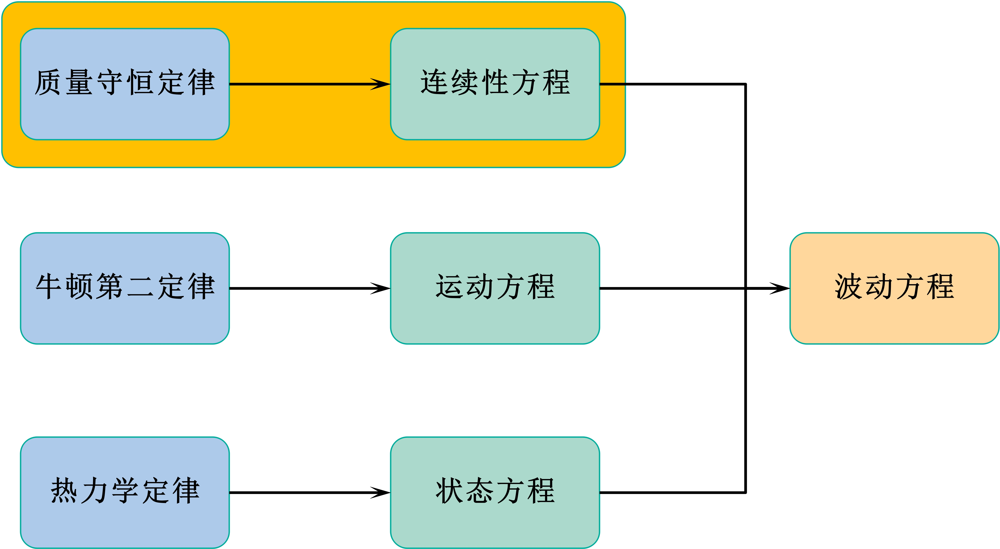

# 5. 连续性方程

**注意：本节中的所有关于质点振速（矢量场）、密度（标量场）的物理符号都表示场，它们都是空间和时间的函数，为了方便，只写前面的符号，后面关于空间和时间的符号 $(x, y, z, t)$ 省略。**

## 5.1 质量守恒定律

在连续介质中，如果流进与流出某一空间体积的流体质量不等，则必引起该体积中介质密度的变化。

介质中存在一立方体体积元，边长分别为 $dx、dy、dz$，立方体中心点 $M$ 点的密度为 $\rho_t$，介质流过 $M$ 点的速度向量表示为： 
$$
\overrightarrow{U}=U_x \overrightarrow{i} + U_y \overrightarrow{j} + U_z \overrightarrow{k}
$$
则单位时间单位面积的介质质量可表示为：
$$
\rho_t \overrightarrow{U} = \rho_t U_x \overrightarrow{i} + \rho_t U_y \overrightarrow{j} + \rho_t U_z \overrightarrow{k}
$$
$\rho_t \overrightarrow{U}$ 表示单位面积上的[质量流速](https://baike.baidu.com/item/%E8%B4%A8%E9%87%8F%E6%B5%81%E9%80%9F/5163867?fr=aladdin)，也就是流体在单位时间内流过单位流通界面积的质量。

## 5.2 连续方程推导（一）

### 5.2.1 流速引起的质量变化

根据泰勒展开式并保留一阶项，在 $dt$ 时间段内，从 $ADHE$ 面流入立方体中的质量为：
$$
\left[ \rho_t U_x + \frac{\partial \left( \rho_t U_x \right)}{\partial x} \cdot \left( - \frac {dx} 2 \right) \right] dydz \cdot dt
$$
在 $dt$ 时间段内，从 $BCGF$ 面流入立方体的质量为：
$$
-\left[ \rho_t U_x + \frac{\partial \left( \rho_t U_x \right)}{\partial x} \cdot \left( \frac{dx} 2 \right) \right] dydz \cdot dt
$$
则在 $dt$ 时间段内 $X$ 方向流入立方体的总质量为：
$$
(3)+(4)=-\left[ \frac{\partial}{\partial x} \left( \rho_t U_x \right) \right]dxdydz \cdot dt
$$
同理可得，在 $dt$ 时间段内 $Y$ 方向流入立方体的总质量为：
$$
-\left[ \frac{\partial}{\partial y} \left( \rho_t U_y \right) \right]dxdydz \cdot dt
$$
同理可得，在 $dt$ 时间段内 $Z$ 方向流入立方体的总质量为：
$$
-\left[ \frac{\partial}{\partial z} \left( \rho_t U_z \right) \right]dxdydz \cdot dt
$$
综上所述，$dt$ 时间段内质点振速引起的立方体质量变化为：
$$
\Delta m = -\left[ \frac{\partial}{\partial x} \left( \rho_t U_x \right) + \frac{\partial}{\partial y} \left( \rho_t U_y \right) + \frac{\partial}{\partial z} \left( \rho_t U_z \right) \right]dxdydz \cdot dt \\ = - \nabla \cdot \left( \rho_t \overrightarrow{U} \right) \cdot dxdydz \cdot dt
$$

### 5.2.2 质量变化引起的密度变化

立方体体积没有变化，质量的变化必然引起介质密度的变化，可表示为：
$$
\Delta m = \left[ \rho_t \left( t + dt \right) - \rho_t (t) \right]dxdydz = \frac {\partial \rho_t} {\partial t} \cdot dxdydz \cdot dt
$$

### 5.2.3 连续性方程

$$
(8) = (9) \Rightarrow -\nabla \cdot \left( \rho_t \overrightarrow{U} \right) = \frac{\partial \rho_t}{\partial t}
$$

## 5.3 连续性方程推导（二）

在介质中取一立方体，质量流速的变化一定会引起质量的变化，则单位时间内质量的变化量（质量流量）为质量流速的变化量与流通界面的乘积。

单位时间 $dt$ 内，$X$ 方向的质量变化可表示为：
$$
\Delta m_x = -\frac{\partial}{\partial x}\left( \rho_t U_x \right)dxdydz
$$
同理可得单位时间内 $Y$ 方向和 $Z$ 方向的质量变化为：
$$
\Delta m_y = -\frac{\partial}{\partial y}\left( \rho_t U_y \right)dxdydz \\
\Delta m_z = -\frac{\partial}{\partial z}\left( \rho_t U_z \right)dxdydz
$$
单位时间内立方体内质量变化为式（8）。

图中质量流速沿 $X$ 方向是越来越慢，说明质量在增加，在体积不变的情况下，质量的增加一定会导致密度的上升。单位时间内质量的增加量为密度的变化量与立方体体积的乘积。立方体中密度是均匀的（因为足够小，考虑为密度均匀），所以单位时间 $dt$ 内密度的变化量为 $\frac{\partial \rho_t}{\partial t}$，则单位时间内质量的增加量为：
$$
\Delta m = \frac{\partial \rho_t}{\partial t} dxdydz
$$
联立（11）-（13）可得连续方程（10）。

**你一定会疑惑：**

**1. 质量流速为什么是直线变化的？**

> 因为质量元是很小的立方体，而且还有质量流速的变化。考虑导数的定义
> $$
> f'(x) = \lim_{x_2 \to x_1} \frac{f(x_2) - f(x_1)}{x_2 - x_1}
> $$
> 当 $x_2 \to x_1$ 时，斜率和导数是无限趋近的。所以可以将质量流速的变化考虑为线性变化。

**2. 质量流速的变化率为什么是负的？**

> 其实质量流速的变化率是负的还是正的，对于结果（连续性方程）是没有影响的。质量流速的变化率为负，式（8）为负，表明立方体内的质量在增加，则密度一定上升，式（13）为正。质量流速的变化率为正，式（8）为正，表明立方体内的质量在减少，则密度一定下降，式（13）为负。所以对结果（连续性方程）是没有影响的。

## 5.4 使用基本声学量表示连续性方程

**基本声学量包括三个：声压（$p$）、质点振速（$\overrightarrow{u}$）、密度余量（$\rho$）。**
$$
\overrightarrow{U} = \overrightarrow{U_0} + \overrightarrow{u} \\
\rho_t = \rho_0 + \rho
$$
**假设条件：无声场情况下，介质均匀静止。**

其中，$\overrightarrow{U}$ 表示受到声波扰动后的总的质点振速；$\overrightarrow{U_0}$ 表示无声波情况下的质点振速 $\overrightarrow{U_0} = 0$；$\overrightarrow{u}$ 表示受到声波扰动后的质点振速；$\rho_t$ 表示受到声波扰动后的介质密度；$\rho_0$ 表示无声波扰动时的介质密度，根据假设条件可知，其为某一常数，表示常量场；$\rho$ 表示受到声波扰动后的介质密度变化量。其中 $\overrightarrow{u}、\rho$ 都是小量，小量和小量的乘积可以忽略不计。

连续性方程为：
$$
-\nabla \cdot \left( \rho_t \overrightarrow{U} \right) = \frac{\partial \rho_t}{\partial t} \\ \Rightarrow -\nabla \left( \rho_0 + \rho \right) \cdot \overrightarrow{u} = \left( \rho_0 + \rho \right) \nabla \cdot \overrightarrow{u}
$$
因为 $\rho_0 + \rho$ 为一常数（和空间无关），所以其梯度为 0，又因为 $\rho、\nabla \cdot \overrightarrow{u}$ 都是小量，所以乘积为 0。

则连续性方程的左边可表示为：
$$
-\rho_0 \nabla \cdot \overrightarrow{u}
$$
连续方程的右边：
$$
\frac{\partial \rho_t}{\partial t} = \frac{\partial \left( \rho_0 + \rho \right)}{\partial t}
$$
$\rho_0$ 为一常量场，所以其对时间的偏导为 0。
$$
\frac{\partial \rho_t}{\partial t} = \frac{\partial \rho}{\partial t}
$$
所以使用基本声学量表示为连续性方程为：
$$
(17)=(19) \Rightarrow \frac{\partial \rho}{\partial t} + \rho_0 \nabla \cdot \overrightarrow{u} = 0
$$

## 5.5 连续性方程的物理意义

**当介质的质点振速在空间发生变化时，即存在速度散度时，相应的发生密度变化，速度散度的变化与相对密度变化符号相反。**