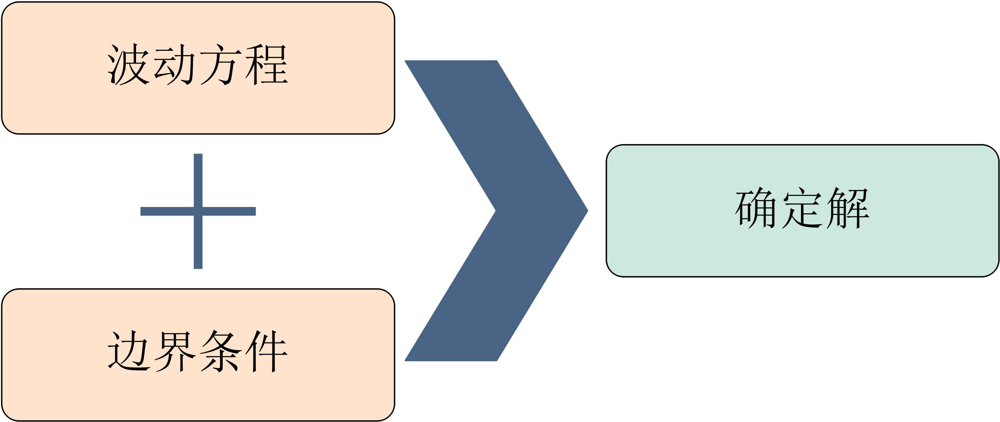
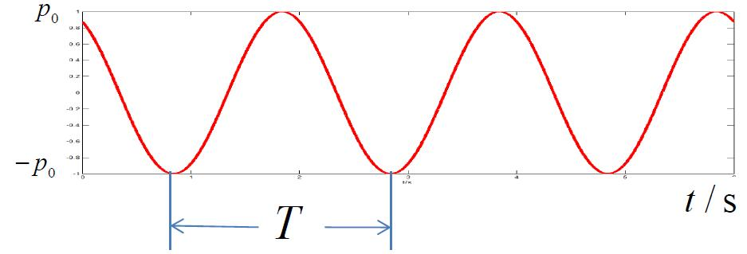
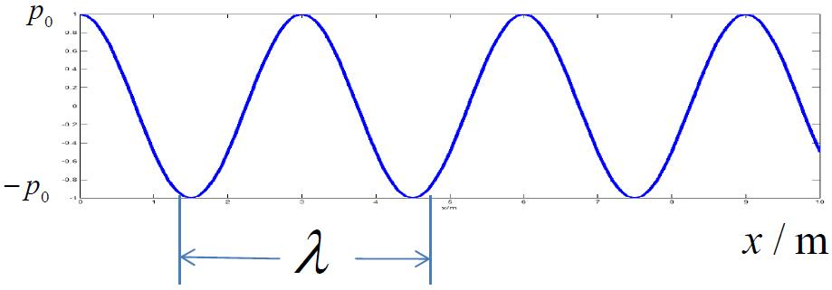

# 12 平面简谐波声压场

## 12.1 平面简谐波

`平面简谐波` 中有两个重点：

1. `简谐`：声源随时间作简谐运动。

   > 随时间简谐变化的声场是分析随时间复杂变化的声场的基础。因为根据傅里叶分析，任意时间函数的振动原则上都可以分解为许多不同频率的简谐函数的叠加（或积分），可通过不同频率的机械振动叠加（或积分）来求得复杂时间函数的振动规律。

2. `平面波`：波阵面为平面的波为平面波。

   > **`波阵面`：声场中具有相同振动状态各点构成的空间曲面**。
   >
   > 事实上，平面波是一种理想的声波场，在现实生活中找不到完全符合定义的平面波。我们可以设想在无限均匀介质中有一个无限大平面刚性物体沿法线方向来回振动，这时所产生的声场就是平面波场。其实我们可以考虑平行光，就像太阳光到达地球时，我们认为其光是平行光，也是平面波。由这个实际的例子可以得到，当一个振源无限大，在无限远处形成的场，基本符合平面波场的定义。

## 12.2 平面简谐波声压场

在 [波动方程](./8-波动方程.md) 一节中我们已经得到波动方程的表达式为
$$
\nabla^2p - \frac 1{c_0^2}\frac{\partial^2p}{\partial t^2} = 0
$$

要想求出声场的确定解，需要波动方程和边界条件的共同作用。

假设波沿 $X$ 轴方向传播，平面波的波动方程简化为一维波动方程，表示为
$$
\frac {\partial^2 p}{\partial x^2} - \frac 1 {c_0^2}\frac{\partial^2 p}{\partial t^2} = 0
$$
由于声源作简谐振动，所以平面简谐波声压场可表示为
$$
p(x, t) = p(x)e^{j \omega t}
$$
将式（3）代入一维波动方程（2）可得
$$
e^{j \omega t} \left[ \frac{\partial^2 p(x)}{\partial x^2} + k^2 p(x) \right] = 0 \\
\Rightarrow \frac{\partial^2 p(x)}{\partial x^2} + k^2 p(x)  = 0
$$
其中，$k = \omega / c_0 = 2\pi / \lambda$，称为波数。

根据二阶常系数偏微分方程的通解，可得声压的复数形式为
$$
p(x)=Ae^{-jk x} + B e^{jk x}
$$
其中，$A、B$ 为两个待定常数，由边界条件决定。

将式（5）代入式（3）可得平面简谐波声压场方程为
$$
p(x, t) = Ae^{j(\omega t - kx)} + Be^{j(\omega t + kx)}
$$
其中，**第一项表示沿 $X$ 轴正向传播的波；第二项表示沿 $X$ 轴负向传播的波**。

然后根据边界条件确定其具体形式。

**边界条件1（无穷远边界条件）：声波传播到无穷远处消失**

在无限空间中，不存在反射体，也就不出现反射波。表示波只沿 $X$ 轴正向传播，不存在沿 $X$ 轴负向传播的波，则
$$
p(x, t) = Ae^{j(\omega t - kx)}
$$
**边界条件2：振源表面声压已知**

设振源表面的声压为
$$
\left. p(x, t) \right|_{x = 0} = p_0 e^{j \omega t}
$$
代入式（7）可得
$$
A = p_0
$$
则平面简谐波声压场可表示为
$$
p(x, t) = p_0 e^{j(\omega t - kx)}
$$
平面简谐波声压分布为
$$
p(x, t) = p_0 \cos (\omega t - kx)
$$
声压随时间变化图如下图所示。

声压场中声压的空间变化如下图所示。

## 12.3 平面简谐波声压场的特点

> 1. 平面波传播时，在 $x = x_1$ 平面上的点比 $x = 0$ 的振动落后的相位角为 $\phi_1 = kx_1$。
>
> 2. 假设经过 $\Delta t$ 时间以后，声波传播到 $x_0 + \Delta x$ 处，如果
>
>    $\Delta x = 0$，波仍在原处；
>
>    $\Delta x > 0$，波沿 $X$ 轴正向移动；
>
>    $\Delta x < 0$，波沿$X$ 轴负向移动。
>
> 3. 假设在 $t_0$ 时刻、$x_0$ 处的声波，在 $t_0 + \Delta t$ 时刻传播到 $x_0 + \Delta x$，波形保持不变，则
>    $$
>    \begin{align}
>    p(x_0, t_0) &= p_0e^{j(\omega t_0 - k x_0)} \\
>    p(x_0 + \Delta x, t_0 + \Delta t) &= p_0 e^{j[\omega (t_0 + \Delta t) - k(x_0 + \Delta x)]}
>    \end{align}
>    $$
>    由于 $p(x_0, t_0) = p(x_0 + \Delta x, t_0 + \Delta t)$，可得
>    $$
>    \omega \Delta t- k \Delta x = 0 \\
>    c_0 = \frac {\omega} {k} = \frac{\Delta x}{\Delta t}
>    $$
>    其中，$c_0$ 代表单位时间内平面波传播的距离，也就是平面波的声传播速度，简称 **声速**。

在状态方程中，引入了等熵波速的概念，表示为
$$
c_0 \equiv \sqrt{\left( \frac{\partial P}{\partial \rho} \right)_{\rho_0,s_0}}
$$
它反映的是**介质受到声波扰动时的压缩特性**。

- **介质的可压缩性大，传播速度慢；**
- **介质的可压缩性小，传播速度快**。

声波传播速度和波速的区别：

- 波速反映了介质的可压缩性，和声波的传播速度有关，但它是介质固有的属性，和具体的波没有关系。对于某种参数一定的介质，其波速是一个定值。
- 声波传播速度则是描述声波在介质中传播的速度，和具体的波有关。同一种介质中不同类型的波的传播速度不同。
- 理想流体中的平面波的传播速度和波速在数值上是相等的。

