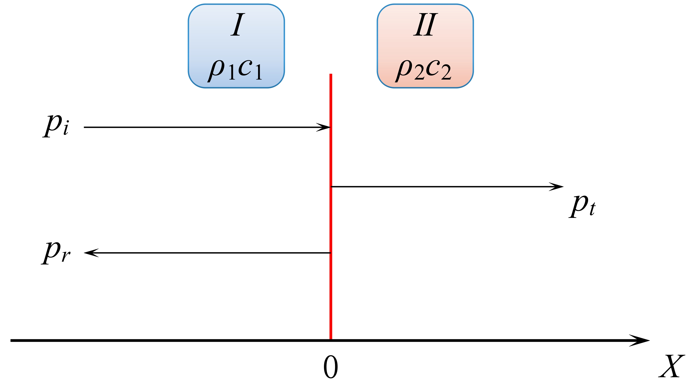

# 16 平面波垂直入射

## 16.1 模型构建

设有左右两种半无限大介质，介质 $\mathrm{I}$ 和介质 $\mathrm{II}$，其特性阻抗分别为 $\rho_1c_1、\rho_2c_2$。$x = 0$ 为两介质的分界面，平面波沿 $X$ 方向入射到分界面上发生反射和透射，箭头所指的方向为声传播方向。上图中， $p_i$ 为入射波，$p_r$ 为反射波，$p_t$ 为透射波。

根据两介质中的声压波动方程
$$
\frac{\partial^2 p_1}{\partial x^2} - \frac 1 {c_1^2}\frac{\partial^2 p_1}{\partial t^2} = 0 \ \ \ (x \le 0) \\
\frac{\partial^2 p_2}{\partial x^2} - \frac 1 {c_2^2}\frac{\partial^2 p_2}{\partial t^2} = 0 \ \ \ (x \ge 0) 
$$
在 $x \ge 0$ 半无限空间中，没有反射波，只有沿 $X$ 轴正向传播的波，所以声压波动方程的解为
$$
p_2 = p_t^0 e^{j(\omega t - k_2x)}
$$
其中，$p_t^0$ 为透射波声压振幅。根据欧拉方程 $\overrightarrow{u} = - \frac 1 {\rho_0} \int \frac {\partial p}{\partial x}dt$，可得 $x \ge 0$ 半无限空间的质点振速满足方程
$$
\overrightarrow{u_2} = \frac{p_t^0}{\rho_2c_2} e^{j(\omega t - k_2 x)} \overrightarrow{i} = u_t^0 e^{j(\omega t - k_2 x)} \overrightarrow{i}
$$
其中，$u_t^0 = \frac{p_t^0}{\rho_2c_2}$。

在 $x \le 0$ 半无限空间中，既有入射波又有反射波，所以声压波动方程的解为
$$
p_1 = p_i^0 e^{j(\omega t - k_1 x)} + p_r^0 e^{j(\omega t + k_1 x)}
$$
其中，$p_i^0、p_r^0$ 分别为入射波声压和反射波声压。根据欧拉方程 $\overrightarrow{u} = - \frac 1 {\rho_0} \int \frac {\partial p}{\partial x}dt$，可得 $x \le 0$ 半无限空间的质点振速满足方程
$$
\overrightarrow{u_1} = \frac{p_i^0}{\rho_1c_1} e^{j(\omega t - k_1x)} \overrightarrow{i} + \frac{p_r^0}{\rho_1c_1} e^{j(\omega t + k_1x)} \overrightarrow{i} \\ 
= u_i^0 e^{j(\omega t - k_1x)} + u_r^0 e^{j(\omega t + k_1x)}
$$
其中，$u_i^0 = \frac{p_i^0}{\rho_1 c_1}，u_r^0 = -\frac{p_t^0}{\rho_1c_1}$。

## 16.2 根据声学边界条件求解

通过声压连续 $\left. p_1 \right|_{x = 0} = \left. p_2 \right|_{x = 0}$ 和质点振速连续 $\left. \overrightarrow{u_1} \right|_{x = 0} = \left. \overrightarrow{u_2} \right|_{x = 0}$ 两个边界条件，可得
$$
\begin{align}
p_i^0 + p_r^0 &= p_t^0 \\
u_i^0 + u_r^0 &= u_t^0
\end{align}
$$

## 16.3 反射系数和折射系数

### 16.3.1 反射系数和折射系数的定义

> `声压反射系数`：**分界面处复反射声压与复入射声压的比值，表示为：$R_p = \frac{\tilde{p_r}(x, t)}{\tilde{p_i}(x, t)}$**。
>
> `声压折射系数`：**分界面处复透射声压与复入射声压的比值，表示为：$D_p = \frac{\tilde{p_t}(x, t)}{\tilde{p_i}(x, t)}$**。
>
> `振速反射系数`：**分界面处复反射振速与复入射振速的比值，表示为：$R_u=\frac{\tilde{u_r}(x, t)}{\tilde{u_i}(x, t)}$**。
>
> `振速折射系数`：**分界面处复透射振速与复入射振速的比值，表示为：$D_u = \frac{\tilde{u_t}(x, t)}{\tilde{u_i}(x, t)}$**。

### 16.3.2 声压反射系数和折射系数推导

根据公式（6），等式两边同时除以入射声压 $p_i^0$，可得
$$
\frac{p_i^0}{p_i^0}+ \frac{p_r^0}{p_i^0} = \frac{p_t^0}{p_i^0} \\
\Rightarrow 1 + R_p = D_p
$$
根据公式（7），等式两边同时除以入射声压 $p_i^0$，可得
$$
\frac{p_i^0}{p_i^0 \cdot \rho_1 c_1 } - \frac{p_r^0}{p_i^0 \cdot \rho_1 c_1} = \frac{p_t^0}{p_i^0 \cdot \rho_2 c_2} \\
\Rightarrow \frac{1}{\rho_1 c_1} - \frac{R_p}{\rho_1 c_1} = \frac{D_p}{\rho_2 c_2}
$$
联立式（8）、（9）可得声压反射系数和折射系数为
$$
R_p = \frac{\rho_2 c_2 - \rho_1 c_1}{\rho_2 c_2 + \rho_1 c_1}  = \frac{Z_2 - Z_1}{Z_2 + Z_1}\\
D_p = \frac{2\rho_2 c_2}{\rho_2 c_2 + \rho_1 c_1} = \frac{2Z_2}{Z_2 + Z_1}
$$

### 16.3.3 振速反射系数和折射系数

根据公式（6），等式两边同时除以入射振速 $u_i^0$，可得：
$$
\begin{equation}
\rho_1 c_1 - \rho_1 c_1 \cdot R_u = \rho_2 c_2 \cdot D_u
\end{equation}
$$
根据公式（7），等式两边同时除以入射振速 $u_i^0$，可得：
$$
1 + R_u = D_u
$$
联立式（11）、（12）可得声压反射系数和折射系数为
$$
R_u = \frac{\rho_1 c_1 - \rho_2 c_2}{\rho_1 c_1 + \rho_2 c_2} = \frac{Z_1 - Z_2}{Z_2 + Z_1}\\
D_u = \frac{2 \rho_1 c_1}{\rho_2 c_2 + \rho_1 c_1} = \frac{2Z_1}{Z_2 + Z_1}
$$
对比式（10）与（13）可以看出，**当声波垂直入射时，平面波在分界面上的反射系数和透射系数的只取决于介质的特性阻抗，说明介质的特性阻抗对声传播有重要影响。**

## 16.4 反射系数和折射系数的大小对声传播和折射的影响

### 16.4.1 两种介质的特性阻抗相等

当两种介质的特性阻抗相等时，即 $Z_2 = Z_1$，可得：
$$
R_p = R_u = 0 \\
D_P = D_u = 1
$$
**式（14）表示界面上声波没有发射，即全部透射。即两种介质的特性阻抗相等，那么两介质的界面就好像不存在一样，声波全部透射。**

### 16.4.2 硬边界

当界面为硬边界时，即 $Z_2 > Z_1$，则
$$
R_p > 0, R_u < 0 \\
D_p > 0, D_u > 0
$$
从式（15）可以看出：

- **声波有反射也有透射；**
- **反射波声压、透射波声压和入射波声压幅度符号都相同；**
- **反射波质点振速和入射波质点振速幅度符号相反，透射波质点振速和入射波质点振速幅度符号相同。**

### 16.4.3 软边界

当界面为软边界时，即 $Z_2 < Z_1$，则
$$
R_p < 0, R_u > 0 \\
D_p > 0, D_u > 0
$$
从式（16）可以看出：

- **声波有反射也有透射；**
- **反射波声压和入射波声压幅度符号相反，透射波声压和入射波声压幅度符号相同；**
- **反射波质点振速、透射波质点振速和入射波质点振速幅度符号都相同。**

### 16.4.4 绝对硬边界

界面为“绝对硬”边界时，即 $Z_2 >> Z_1$，则 
$$
R_p \approx 1, R_u \approx -1 \\
D_p \approx 2, D_u \approx 0
$$
从式（17）可以看出：

- **声波全部反射；**
- **反射波声压和入射波声压幅度相等，在界面处的透射声压是入射声压的两倍；**
- **反射波质点振速和入射波质点振速幅度大小相等、符号相反，在分界面上合成的质点振速为零；**
- **发生了全反射，在介质 $\mathrm{I}$ 中入射波和反射波叠加形成驻波，在分界面处恰是 `振速波节` 和 `声压波腹`；**
- **在介质 $\mathrm{II}$ 中没有声速传播，介质 $\mathrm{II}$ 的质点并没有因为介质质点的冲击而运动，介质 $\mathrm{II}$ 中存在的压强也只是分界面处压强的静态传递，并不是疏密交替的声压。**

### 16.4.5 绝对软边界

当界面为“绝对软”边界时，即 $Z_2 << Z_1$，则
$$
R_p \approx -1, R_u \approx 1 \\
D_p \approx 0, D_u \approx 2
$$
从式（18）可以看出

- **声波全部反射；**
- **反射波声压和入射波声压幅度相等、符号相反，在分界面上合成声压为零；**
- **反射波质点振速和入射波质点振速幅度相等，在界面处的质点振速是入射波质点振速的两倍；**
- **发生了全反射，在介质 $\mathrm{I}$ 中入射波和反射波叠加形成驻波，分界面处恰是 `振速波腹` 和 `声压波节`；**
- **在介质 $\mathrm{II}$ 中没有声波传播。**