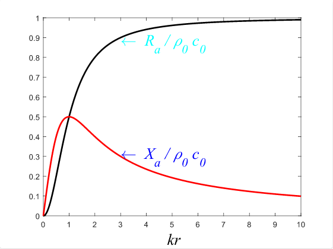
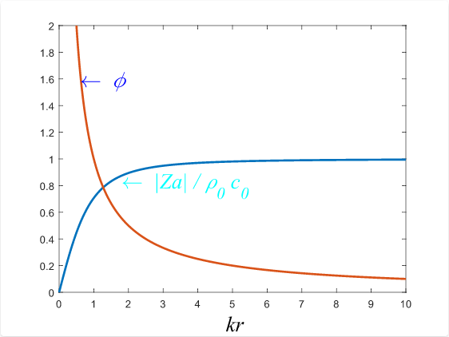
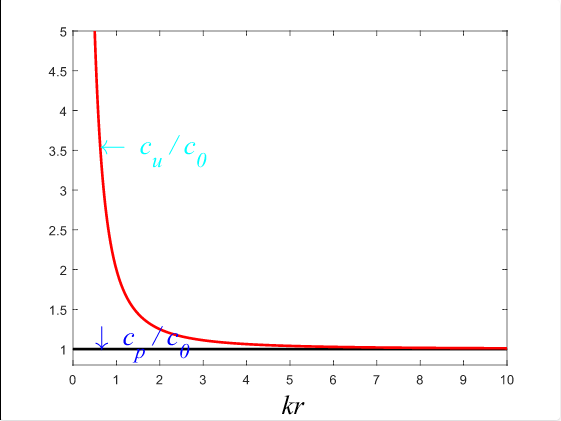

# 22 球面波

## 22.1 球面波

**`球面波`：波阵面为同心球面的波。**如图所示。

根据 [9-波动方程在直角坐标系、柱坐标系、求坐标系中的表示](./9-波动方程在直角坐标系、柱坐标系和球坐标系中的表示.md) 中可以得到速度势波动方程在球坐标系下的形式为：
$$
\frac{1}{r^2}\frac{\partial}{\partial r}\left( r^2 \frac{\partial \Psi(\overrightarrow{r}, t)}{\partial r} \right) + \frac{1}{r^2 \sin \theta} \frac{\partial }{\partial \theta} \left( \sin \theta \frac{\partial \Psi(\overrightarrow{r}, t)}{\partial \theta} \right) + \frac{1}{r^2}\frac{1}{\sin^2 \theta}\frac{\partial^2 \Psi(\overrightarrow{r}, t)}{\partial \phi^2} - \frac{1}{c_0^2} \frac{\partial^2 \Psi(\overrightarrow{r}, t)}{\partial t^2} = 0
$$
若为球面波，使球坐标原点与球面波球心重合，则波场函数与坐标变量 $\theta, \phi$ 无关，则
$$
\begin{cases} \frac{\partial \Psi}{\partial \theta} = 0 \\ \frac{\partial \Psi}{\partial \phi} = 0  \end{cases} \Rightarrow \Psi(\overrightarrow{r}, t) = \Psi(r, t)
$$
则式（1）简化为
$$
\frac{1}{r^2}\frac{\partial}{\partial r}\left( r^2 \frac{\partial \Psi}{\partial r} \right) - \frac{1}{c_0^2} \frac{\partial^2 \Psi}{\partial t^2} = 0 \\
\Downarrow \\
\frac{\partial^2}{\partial r^2}\left[ r \Psi(r, t) \right] - \frac{1}{c_0^2} \frac{\partial^2}{\partial t^2} \left[ r \Psi(r, t) \right] = 0,\ \ \ \ \ \  r \ne 0 
$$
式（2）被称为 **[达朗贝尔方程](https://baike.baidu.com/item/%E8%BE%BE%E6%9C%97%E8%B4%9D%E5%B0%94%E6%96%B9%E7%A8%8B/23133516?fr=aladdin)**，它的解被称为 `大朗贝尔解`，式（2）的通解为
$$
r\Psi(r, t) = f_1(r - c_0t) + f_2(r + c_0 t) \\
\Downarrow \\
\Psi(r, t) = \frac{1}{r}f_1(r - c_0t) + \frac{1}{r}f_2(r + c_0 t)
$$
其中，前一项 $\frac{1}{r} f_1(r - c_0t)$ 表示沿 $r$ 正向传播的波，也被称为 `扩张波`；后一项  $\frac{1}{r} f_1(r + c_0t)$ 表示沿 $r$ 负项传播的波，也称 `收敛波`。若无 `收敛波`，则可将后一项略去，只有 `扩张波` 时，速度势函数可表示为
$$
\Psi(r, t) = \frac{1}{r} f_1 (r - c_0t)
$$
在 [8-波动方程](./8-波动方程.md) 中，我们已经推导了声压和质点振速分别于速度势函数之间的关系为
$$
p(r, t) = \rho_0 \frac{\partial \Psi}{\partial t} \\
\overrightarrow{u} = -\nabla \Psi(r, t)
$$
根据式（6），可以推导出球面波的生涯和速度势之间的关系为
$$
p(r, t) = \rho_0 \frac{\partial \Psi}{\partial t} = - \frac{\rho_0 c_0}{r} f_1'(r - c_0 t)
$$
根据式（6），可以推导出球面波的质点振速与速度势之间的关系为
$$
\overrightarrow{u} = \nabla \Psi(r, t) = \left[ -\frac{1}{r} f_1'(r - c_0 t) + \frac{1}{r^2}f_1(r - c_0 t) \right] \overrightarrow{e_r}
$$
其中，$\overrightarrow{e_r}$ 为球坐标失径方向的单位向量。

从式（7-8）可以看出：

**1. 声压和质点振速的幅值随传播距离衰减；**

**2. 质点振速和声压的信号波形不同；但 $r$ 足够大后，质点振速表达式中的后一项相对前一项小得多，可略去，可以认为质点振速与声压的波形相同。**

## 12.2 球面简谐波

**`球面简谐波`：等相位面为球面切等相位面上振幅相同的波。**

### 12.2.1 声压

球面简谐波场可表示为
$$
\tilde{p}(r, t) = p(r) e^{j \omega t}
$$
将式（9）带入式（3）中可得
$$
\frac{d^2\left[r p(r) \right]}{dr^2} + k^2 \left[ rp(r) \right] = 0
$$
根据二阶常系数齐次线性方程，可得其解为
$$
r p(r) = Ae^{-jkr} + B e^{jkr}\\
\Downarrow \\
\tilde{p}(r, t) = \frac{1}{r} \left( Ae^{-jkr} + B e^{jkr} \right) e^{j \omega t} = \frac{A}{r}e^{j(\omega t - kr)} + \frac{B}{r}e^{j(\omega t + kr)}
$$
其中，前一项 $ \frac{A}{r}e^{j(\omega t - kr)}$ 表示沿 $r$ 正向传播的波，称为 `扩张波` ，随着时间的增加，等相位面逐渐扩大；后一项 $ \frac{A}{r}e^{j(\omega t + kr)}$  表示沿 $r$ 负向传播的波，称为 `收敛波` ，随着时间增加，等相位面逐渐减小。

对于扩张球面波，其声压函数可以表示为
$$
\tilde{p}(r, t) = \frac{A}{r} e^{j(\omega t - kr)}
$$

### 12.2.2 质点振速

根据欧拉公式 $\overrightarrow{u} = -\frac{1}{\rho_0}\int {\nabla p} dt$，则质点振速函数可表示为
$$
\tilde{u}(r, t) = - \frac{1}{\rho_0} \int {\frac{\partial \tilde{p}}{\partial r}} dt = -\frac{A}{\rho_0} \int \left[{-\frac{1}{r^2} e^{j(\omega t - kr)} - \frac{jk}{r} e^{j(\omega t - kr)}} \right]dt \\
= \frac{A}{r} \frac{1}{\rho_0}\left[ \frac{1}{j \omega r} + \frac{jk}{j\omega} \right] e^{j(\omega t - kr)} = \frac{1}{\rho_0 c_0} \frac{A}{r} \left[ \frac{1 + jkr}{jkr} \right] e^{j(\omega t - kr)}
$$

### 12.2.3 波阻抗

球面波波阻抗表示为
$$
Z_a = \frac{\tilde{p}(r, t)}{\tilde{u}(r, t)} = \frac{\frac{A}{r}e^{j(\omega t - kr)}}{\frac{1}{\rho_0 c_0} \frac{A}{r} \left[ \frac{1 + jkr}{jkr} \right] e^{j(\omega t - kr)}} \\ = \frac{jkr}{1 + jkr}\rho_0 c_0 = \frac{(kr)^2 + jkr}{1 + (kr)^2} \rho_0 c_0 = R_a + jX_a
$$
其中，$R_a = \frac{(kr)^2}{1 + (kr)^2} \rho_0 c_0$，表示 `波阻`；$X_a = \frac{kr}{1 + (kr)^2} \rho_0 c_0$，表示 `波抗`。

从式（14）和上图可以看出

**1. 球面扩张波的波阻抗不是常数，与平面波的波阻抗（$\rho_0 c_0$）不同；**

**2. 当 $kr$ 值很大时，球面扩张波波阻抗和平面行波的波阻抗近似相等。**

波阻抗的模值可表示为
$$
\left| Z_a \right| = \sqrt{(R_a)^2 + (X_a)^2} = \frac{kr}{\sqrt{1 + (kr)^2}} \rho_0 c_0 
$$
波阻抗的幅角可表示为
$$
\phi = \arctan \left( \frac{X_a}{R_a} \right) = \arctan \left( \frac{1}{kr} \right)\\
\Downarrow \\
kr = \frac{1}{\tan \phi}
$$

$$
\left|Z_a \right| = \frac{kr}{\sqrt{1 + (kr)^2}} \rho_0 c_0 = \frac{\frac{1}{\tan \phi}}{\sqrt{1 + \left( \frac{1}{\tan \phi} \right)^2}} = \rho_0 c_0 \cos \phi 
$$

## 12.3 相速度

**`相速度`：简谐波场中的某一声学量的等相位面的传播速度。**

简谐球面波的声压函数如式（12）所示，所以声压的等相位面函数为
$$
\phi_p = \omega t - kr = constant
$$
所以声压的相速度表示为
$$
c_p = \left. \frac{dr}{dt} \right|_{\phi_p = constant} = \frac{\omega}{k} = c_0
$$
**简谐球面波的声压相速度等于介质的波速 $c_0$。**

简谐球面波的质点振速如式（13）所示，根据波阻抗公式（14），可得质点振速函数为
$$
\tilde{u}(r, t) = \frac{\tilde{p}(r, t)}{Z_a} = \frac{\frac{A}{r}e^{j (\omega t - kr)}}{\left| Z_a \right| e^{j \phi}} = \frac{A}{r \left| Z_a \right|}e^{j(\omega t - kr - \phi)}
$$
其中，$\left| Z_a \right|$ 如式（15）所示，$\phi$ 如式（16）所示。

则质点振速的等相位面函数为
$$
\begin{CD}
\phi_u = \omega t - kr - \phi = constant \\
@VV两边同时微分V \\
\omega dt - kdr - d\phi = 0
\end{CD}
$$
根据式（16），可得幅角的微分得：
$$
d\phi = d\left[ \arctan \left( \frac{1}{kr} \right) \right] = \frac{1}{1 + \left( \frac{1}{kr} \right) ^2} \cdot -1 \frac{1}{(kr)^2}kdr \\ = - \frac{k}{1 + (kr)^2}dr
$$
式（21）表示为
$$
\omega dt - kdr + \frac{kdr}{1 + (kr)^2} = 0 \\
\Downarrow \\
c_u = \left. \frac{dr}{dt} \right|_{\phi_u = constant} = \frac{\omega}{k \frac{(kr)^2}{1 + (kr)^2}} \\ = c_0 \frac{1 + (kr)^2}{(kr)^2} = c_0\left( 1 + \frac{1}{(kr)^2} \right) 
$$

由式（23）和上图可以得出以下结论：

**质点振速的相速度在近场区比声压的相速度快，而在远场 $kr \gg 1$，振速的相速度与声压的相速度趋于一致，为 $c_0$。**

## 12.4 声能流密度与声强

### 12.4.1 声能流密度

$$
\omega(r, t) = p(r, t) u(r, t) = Re\left[ \frac{A}{r} e^{j(\omega t - kr)} \right] \cdot Re \left[ \frac{A}{r \left| Z_a \right|} e^{j(\omega t - kr - \phi)} \right] \\
= \frac{A^2}{r^2 \cos \phi \rho_0 c_0}\cos (\omega t - kr - \phi) \cos(\omega t - kr) \\
= \frac{A^2}{r^2 \cos \phi \rho_0 c_0} \cdot \left\{ \frac{1}{2}\cos \left[2(\omega t - kr) - \phi \right] + \frac{1}{2}\cos \phi \right\} \\
= \left\{ \frac{A^2}{2r^2} \frac{1}{\rho_0 c_0 \cos \phi} \cos \left[2(\omega t - kr) - \phi \right] + \frac{A^2}{2r^2} \frac{1}{\rho_0 c_0} \right\} \\
= \frac{A^2}{2r^2} \frac{1}{\rho_0 c_0} \left\{ \frac{\cos \left[2(\omega t - kr) - \phi\right]}{\cos \phi} + 1 \right\}
$$

### 12.4.2 声强

声强的计算公式为 $ = \frac{1}{T}\int_{-\frac{T}{2}}^{\frac{T}{2}}\omega dt$，则球面波的声强可表示为
$$
I = \frac{1}{T}\int_{-\frac{T}{2}}^{\frac{T}{2}} \frac{A^2}{2r^2} \frac{1}{\rho_0 c_0} \left\{ \frac{\cos \left[2(\omega t - kr) - \phi\right]}{\cos \phi} + 1 \right\}dt \\
= \frac{A^2}{2r^2} \frac{1}{\rho_0 c_0} + \frac{A^2}{2r^2} \frac{1}{\rho_0 c_0}\frac{\omega}{2\pi}\int_{-\frac{\omega}{\pi}}^{\frac{\omega}{\pi}} \frac{\cos \left[2(\omega t - kr) - \phi\right]}{\cos \phi} dt \\ = \frac{A^2}{2r^2} \frac{1}{\rho_0 c_0} = \frac{\left| p(r, t) \right|^2}{2 \rho_0 c_0} \propto \frac {1}{r^2}
$$
由式（25）可以得出以下结论：
**球面简谐波的声强随着距离的平方衰减。**

----

## 附录

### 附录1 大朗贝尔方程推导

$$
\frac{1}{r^2}\frac{\partial}{\partial r}\left( r^2 \frac{\partial \Psi}{\partial r} \right) = \frac{1}{r^2} \left[ 2r \frac{\partial \Psi}{\partial r} + r^2 \frac{\partial^2 \Psi}{\partial r^2} \right] = \frac{2}{r} \frac{\partial \Psi}{\partial r} + \frac{\partial^2 \Psi}{\partial r^2}
$$

对式（1）两边同时乘以半径 $r$，则方程为
$$
2 \frac{\partial \Psi}{\partial r} + r \frac{\partial^2 \Psi}{\partial r^2} = \frac{\partial ^2}{\partial r^2}\left[ r \Psi(r, t) \right] \\
\Downarrow \\
\frac{\partial^2}{\partial r^2}\left[ r \Psi(r, t) \right] - \frac{1}{c_0^2} \frac{\partial^2}{\partial t^2} \left[ r \Psi(r, t) \right] = 0
$$

### 附录2 大朗贝尔解

我们稍对式（2）做一下变形：
$$
\frac{\partial^2}{\partial t^2} u - c_0^2 \frac{\partial^2}{\partial r^2}u = 0, \ \ u = r \Psi(r, t)
$$
对式（28）进行因式分解：
$$
\left( \frac{\partial }{\partial t} + c_0 \frac{\partial }{\partial r} \right) \left( \frac{\partial }{\partial t} - c_0 \frac{\partial }{\partial r} \right) u = 0
$$
通过变换可得：
$$
\begin{cases}
\xi = \xi(r, t), \eta = \eta(r, t) \\
\frac{\partial}{\partial \xi} = \left( \frac{\partial }{\partial t} + c_0 \frac{\partial }{\partial r} \right)\\
\frac{\partial}{\partial \eta} = \left( \frac{\partial }{\partial t} - c_0 \frac{\partial }{\partial r} \right)
\end{cases}
 \Rightarrow \frac{\partial^2 u}{\partial \xi \partial \eta} = 0
$$

$$
\begin{cases}
\frac{\partial}{\partial \xi} = \left( \frac{\partial}{\partial t}\frac{\partial t}{\partial \xi} + \frac{\partial}{\partial r}\frac{\partial r}{\partial \xi} \right) \\
\frac{\partial}{\partial \eta} = \left( \frac{\partial}{\partial t}\frac{\partial t}{\partial \eta} + \frac{\partial}{\partial r}\frac{\partial r}{\partial \eta} \right) 
\end{cases}
$$

由此可以得出:
$$
\begin{cases}
r = c_0 (\xi - \eta) \\
t = \xi + \eta
\end{cases}
\ \ \ \ \ \Rightarrow \ \ \ \ \ 
\begin{cases}
\xi = \frac{1}{2}\left( t + \frac{r}{c_0} \right) \\
\eta = \frac{1}{2}\left( t - \frac{r}{c_0} \right)
\end{cases}
$$
方程（33）两边同时乘以 $2c_0$，依旧可以保证 $\frac{\partial^2 u}{\partial \xi \partial \eta} = 0$，所以式（33）可以写为
$$
\begin{cases}
\xi = \left( r + c_0 t \right) \\
\eta = \left( r - c_0 t \right)
\end{cases}
$$

$$
\begin{CD}
\frac{\partial^2 u}{\partial \xi \partial \eta} = 0 \\
@V \frac{\partial u}{\partial \eta} = f(\eta),\frac{\partial u}{\partial \xi} = f(\xi) V 对 \xi 或 \eta 积分 V  \\
u = f_1(\xi) + f_2(\eta), \ \ \ \ \ f_1(\xi) = \int f(\xi) d\xi \\
@V \xi = \left( r + c_0 t \right) V \eta = \left( r - c_0 t \right) V \\
u = f_1(r + c_0 t) + f_2(r - c_0 t)
\end{CD}
$$

