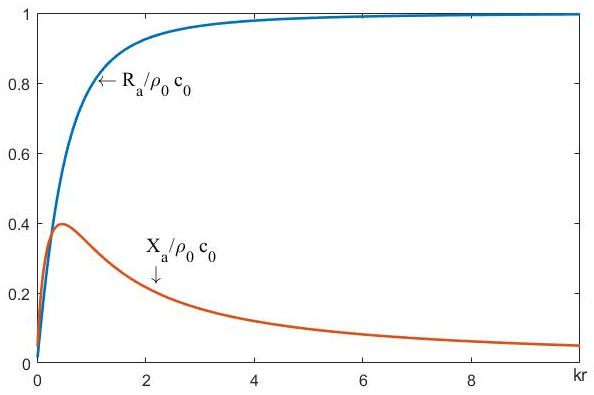

# 24 柱面波

## 24.1 [柱面波](https://baike.baidu.com/item/%E6%9F%B1%E9%9D%A2%E6%B3%A2/2962710?fr=aladdin)

`柱面波`：波阵面为一系列同轴心圆柱面的波。如图1所示。

<b>图1 柱面波示意图</b>

根据速度势波动方程 $\nabla^2 \Psi(\overrightarrow{r}, t) - \frac{1}{c_0^2}\frac{\partial^2 \Psi(\overrightarrow{r}, t)}{\partial t^2} = 0$ 和拉普拉斯算符在柱坐标中的表示 $\nabla^2 = \frac{1}{r}\frac{\partial}{\partial r}\left( r \frac{\partial}{\partial r} \right) + \frac{1}{r^2}\frac{\partial^2}{\partial \phi^2} + \frac{\partial^2}{\partial z^2}$，可将波动方程在柱坐标表示为
$$
\frac{1}{r}\frac{\partial}{\partial r}\left( r \frac{\partial \Psi}{\partial r} \right) + \frac{1}{r^2}\frac{\partial^2 \Psi}{\partial \phi^2} + \frac{\partial^2 \Psi}{\partial z^2} - \frac{1}{c_0^2}\frac{\partial^2 \Psi}{\partial t^2} = 0
$$
柱面波是幅值均匀的，取柱坐标的 $Z$ 轴与柱面波的轴心重合，则其速度势与角度 $\phi$ 和高度 $z$ 无关，即
$$
\Psi(r, \phi, z, t) = \Psi(r, t)
$$
若柱面波为简谐波场，则波动时函数可表示为：$\Psi(r, \phi) = \Psi(r)e^{j \omega t}$，速度势波动方程进一步表示为
$$
1）\Rightarrow \frac{1}{r}\frac{\partial}{\partial r}\left( r \frac{\partial \Psi(r, t)}{\partial r} \right) - \frac{1}{c_0^2}\frac{\partial^2 \Psi(r, t)}{\partial t^2} = 0 \\
\Rightarrow \frac{1}{r}\frac{d}{dr}\left( r \frac{d \Psi(r)}{dr} \right) + k^2 \Psi(r) = 0 \\
$$

$$
\Rightarrow \frac{d^2 \Psi(r)}{dr^2} + \frac{1}{r}\frac{d \Psi(r)}{dr} + k^2 \Psi(r) = 0
$$

## 24.2 柱面简谐波

方程（4）为[零阶贝塞尔方程 ](https://baike.baidu.com/item/%E8%B4%9D%E5%A1%9E%E5%B0%94%E5%87%BD%E6%95%B0/3431101?fr=aladdin)，其解为**零阶柱函数**。表示为
$$
\Psi(r) = A \cdot J_0(kr) + B \cdot N_0(kr)
$$
其中，$J_0(\cdot)$ 为零阶(第一类)贝塞尔函数；$N_0(\cdot)$ 为零阶诺依曼(<i>Neumann Function</i>)函数。它们是零阶贝塞尔方程的两个线性无关的实函数解，是特殊函数。如图2所示。

<b>图2 零阶贝塞尔函数和零阶诺依曼函数曲线图</b>

用零阶贝塞尔函数和零阶诺依曼函数构成两个复函数：
$$
H_0^{(1)}(z) \equiv J_0(z) + jN_0(z) 
$$

$$
H_0^{(2)}(z) \equiv J_0(z) - jN_0(z) 
$$

$H_0^{(1)}(z),\  H_0^{(2)}(z)$ 分别表示第一类和第二类汗克尔函数，它们两个是贝塞尔方程的两个线性无关的复函数解。
$$
\begin{cases}
J_0(kr), N_0(kr) &\text{分别表示柱面驻波场} \\
H_0^{(1)}, H_0^{(2)} &\text{分别表示柱面行波场}
\end{cases}
$$
其中，$H_0^{(1)}$ 表示向柱轴心传播的收敛波；$H_0^{(2)}$ 表示向柱轴心外传播的扩张波。则均匀柱面驻波场的形式解为
$$
\Psi(r, t) = \left[ A_1J_0(kr) + B_1 N_0(kr) \right]e^{j \omega t}
$$
均匀柱面行波场的形式解为
$$
\Psi(r, t) = \left[ A_2H_0^{(1)}(kr) + B_2H_0^{(2)}(kr) \right]e^{j \omega t}
$$

## 24.3 声压和质点振速

简谐均匀扩张柱面波的速度是函数为
$$
\Psi(r, t) = A_0H_0^{(2)}(kr)e^{j \omega t}
$$
声压与速度势函数之间的关系为 [8-波动方程，式（17）](./8-波动方程.md)：
$$
p(r, t) = \rho_0 \frac{\partial}{\partial t}\Psi(r, t)
$$

$$
(12) = \rho_0 \frac{\partial \Psi(r, t)}{\partial t} = \rho_0 \frac{\partial 
\left[
	A_0H_0^{(2)}(kr)e^{j\omega t}
\right]}{\partial t} \\ 
= j \omega \rho_0 A_0 H_0^{(2)}(kr)e^{j\omega t}
$$

质点振速和速度势函数之间的关系为
$$
\overrightarrow{u}(r, t) = - \nabla \Psi(r, t)
$$

$$
(14) = - \frac{\partial \Psi(r, t)}{\partial r} \overrightarrow{e_r} 
= -A_0\frac{d\left[ H_0^{(2)}(kr) \right]}{dr} e^{j\omega t} \overrightarrow{e_r} \\
= A_0 kH_1^{(2)}(kr)e^{j\omega t} \overrightarrow{e_r}
$$

由式（13）和式（15）可以得出以下结论：

**1. 均匀扩张柱面波声压与质点振速的幅值随传播距离是衰减的；**

**2. 同一空间位置的声压与质点振速振动相位不同，当 $kr$ 值很大时，可以近似认为声压与质点振动相位相同。**

## 24.4 波阻抗

柱面波波阻抗可表示为
$$
Z_a = \frac{p(r, t)}{u(r, t)} = \frac{jk\rho_0 c_0 A_0 H_0^{(2)}(kr)e^{j \omega t}}{A_0 k H_1^{(2)}(kr)e^{j \omega t}} \\ = \frac{jk\rho_0 c_0 H_0^{(2)}(kr)}{H_1^{(2)}(kr)} = 
jk\rho_0 c_0 \frac{J_0(kr) - jN_0(kr)}{J_1(kr) - jN_1(kr)} = R_a + jX_a
$$
其中，`波阻 `$R_a$ 可表示为
$$
R_a = \frac{J_1(kr)N_0(kr) - J_0(kr)N_1(kr)}{J_1^2(kr) + N_1^2(kr)}\rho_0 c_0 \\
 = \frac{\frac{2}{\pi kr}}{J_1^2(kr) + N_1^2(kr)}\rho_0 c_0
$$
 **波抗** $X_a$ 可表示为
$$
X_a = \frac{J_0(kr) J_1(kr) + N_0(kr) N_1(kr)}{J_1^2(kr) + N_1^2(kr)}\rho_0 c_0
$$
柱面波波阻抗可表示为
$$
Z_a(r, \omega) = R_a + j X_a = \left| Z_a \right| e ^{j \ \arg(Z_a)}
$$
其中，$Z_a = \sqrt{(R_a)^2 + (X_a)^2}, \ \arg(Z_a) = \arctan(\frac{X_a}{R_a})$。

扩张柱面波波阻和波抗示意图如图3所示。

<b>图3 扩张柱面波波阻和波抗示意图</b>

扩张柱面波波阻抗的模值和幅角如图所示。

<b>图43 扩张柱面波波阻抗的模值和幅角图</b>

利用渐进式可得距柱轴心很远处的波阻抗为：
$$
\left . Z_a(r, \omega) \right|_{r \to \infty} = \left . \frac{j \rho_0 c_0 H_0^{(2)}(kr)}{H_1^{(2)}(kr)} \right |_{r \to \infty} \\ 
\approx j \rho_0 c_0 \frac{\sqrt{\frac{2}{\pi kr}}e^{-j\left( kr - \frac{\pi}{4} \right)} + 0(kr)^{-\frac{3}{2}}}{\sqrt{\frac{2}{\pi kr}}e^{-j\left( kr - \frac{\pi}{2} - \frac{\pi}{4} \right)} + 0(kr)^{-\frac{3}{2}}} \\
\approx j \rho_0 c_0 \frac{1}{e^{-j\left( - \frac{\pi}{2} \right)}} = \rho_0 c_0
$$
**1. 均匀扩张柱面波的波阻抗不是常数，与平面行波的波阻抗不同。当 $kr$ 值很大时，均匀扩张柱面波波阻抗和沿轴正向传播的平面行波波阻抗近似相等，等于介质的特性阻抗 $\rho_0 c_0$**。

**2. 均匀扩张柱面波的质点振速的相速度在近场区（$kr$ 值较小时）比声压的相速度快；在远场区（ $kr$ 值很大时）振速的相速度与声压的相速度趋近一致，为 $c_0$。**

## 24.5 声能流密度

均匀扩张柱面波的声能流密度为
$$
\overrightarrow{\omega}(\overrightarrow{r}, t) = p(\overrightarrow{r}, t)\overrightarrow{u}(\overrightarrow{r}, t) \\
= Re\left[ jk\rho_0 c_0 A_0 H_0^{(2)}(kr)e^{j \omega t}\right] Re \left[ A_0 k H_1^{(2)}(kr)e^{j \omega t} \right]
$$
**均匀扩张柱面波，在近场区（$kr$ 值较小时）有正向声能流和反向声能流；在远场区（$kr$ 值很大时），声能流总是沿 $r$ 正向传播。**

## 24.6 声强

均匀扩张柱面波的声波强度：
$$
I = \frac{1}{T}\int_0^T \overrightarrow{\omega}(\overrightarrow{r}, t)dt = \frac{A_0^2 k \rho_0 c_0}{\pi} \frac{1}{r} \propto \frac{1}{r}
$$
**均匀扩张柱面波的声强随着距离的一次方衰减。**

