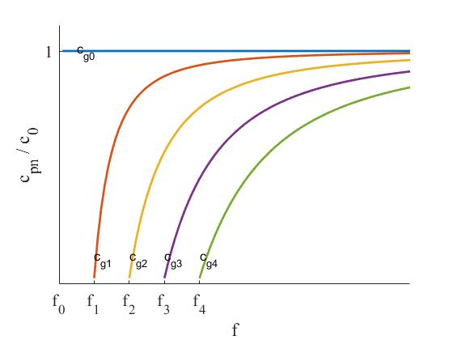

# 25 声波在平行平面层波导中的传播

## 25.1 波导

**`波导`：至少在一维方向上是无限制的有限介质空间。**

声波在平行平面层波导中的传播模型如图1所示。声波在 $x \in [0, h],\ \ z \in [0, +\infty),\ \ y \in (- \infty, + \infty)$ 区域传播。

<b>图1 平行平面层波导模型</b>

## 25.2 平行平面层波导声场的解

根据图1，可得平行平面层波导的波动方程为
$$
\frac{\partial^2 p(x, z, t)}{\partial x^2} + \frac{\partial^2 p(x, z, t)}{\partial z^2} - \frac{1}{c_0^2}\frac{\partial^2 p(x, z, t)}{\partial t^2} = 0 
$$
若声场为简谐声场，则声压可表示为
$$
p(x, z, t) = p(x, z)e^{j \omega t}
$$
将式（2）带入式（1）可得：
$$
\left[ \frac{\partial^2 p(x, z)}{\partial x^2} + \frac{\partial^2 p(x, z)}{\partial z^2} + k^2p(x, z) \right]e^{j \omega t} = 0
$$
式（3）的形式解可表示为
$$
p(x, z) = \sum_{k_x}\left( A e^{-j k_x x} + B e^{j k_x x} \right) \left( Ce^{-jk_z z} + D e^{j k_z z} \right)
$$
且 $k_x^2 + k_z^2 = k^2$。

根据图1可知：

**1. 波场沿 $z$ 轴只有正方向传播的行波，所以 $D = 0$，即辐射条件；**

**2. 波场沿 $x$ 轴是驻波。**

所以式（4）可以简化为
$$
p(x, z) = \sum_{k_x} \left[ 
	A \cos (k_x x) + B \sin (k_x x)
\right] e^{-jk_z z} 
$$

### 25.2.1 绝对硬边界条件下的声场解

对于绝对硬边界条件：
$$
\begin{cases}
\left .u_x(x, z) \right|x_0 = 0 \\
\left. u_x(x, z) \right|x_h = 0
\end{cases}
$$
根据欧拉方程可知，
$$
\begin{cases}
\left. \frac{\partial p(x, z)}{\partial x} \right|x_0 = 0 \\
\left. \frac{\partial p(x, z)}{\partial x} \right|x_h = 0
\end{cases}
$$

$$
\frac{\partial p(x, z)}{\partial x} = - \sum_{k_x} \left[ A k_x \sin (k_x x) - B k_x \cos (k_x x) \right] e^{-jk_z z}
$$

由于 $\left. \frac{\partial p(x, z)}{\partial x} \right|x_0 = 0$，可得 $B = 0$。

由于 $\left. \frac{\partial p(x, z)}{\partial x} \right|x_h = 0$，可得 $\sin(k_x h) = 0 \Rightarrow k_x = \frac{n \pi}{h}, n \in N$。

所以考虑边界条件，波导中波场的形式解可表示为
$$
p(x, z, t) = \sum^ \infty _{n = 0}A_n \cos \left( \frac{n \pi}{h}x \right)e^{-j z\sqrt{k^2 - \left( \frac{n \pi}{h} \right)^2 }}e^{j \omega t}
$$
其中，$A_n$ 由另一个边界条件确定$（z = 0）$处。

### 25.2.2 特例

若源条件为 $\left. u_z \right| _{z = 0} = u_0 e^{j \omega t}$，根据欧拉方程可得
$$
u_z(x, z, t) = - \frac{1}{\rho_0}\int \frac{\partial p(x, z, t)}{\partial z}dt \\
= - \frac{1}{j \omega \rho_0} \frac{\partial p(x, z, t)}{\partial z} \\
= -\frac{1}{j \omega \rho_0} \frac{\partial}{\partial z} 
\left[ 
	\sum_{n = 0}^ \infty A_n \cos \left( \frac{n \pi}{h} x \right) e^{-j \sqrt{k^2 - \left( \frac{n \pi}{h} \right)^2 }z}e^{j \omega t} 
\right] \\
= - \frac{e^{j \omega t}}{j \omega \rho_0} 
	\sum_{n = 0}^ \infty \left[  A_n \cos \left( \frac{n \pi}{h} x \right) \cdot \left(-j \sqrt{k^2 - \left( \frac{n \pi}{h} \right)^2 }\right) e^{-j \sqrt{k^2 - \left( \frac{n \pi}{h} \right)^2 }z} 
\right] \\
= \frac{e^{j \omega t}}{\omega \rho_0} \sum_{n = 0}^\infty \left[
	A_n \cos \left( \frac{n\pi}{h}x \right) \cdot\sqrt{k^2 - \left( \frac{n\pi}{h} \right) ^2} e^{-j \sqrt{k^2 - \left( \frac{n \pi}{h} \right) ^2 }z}
\right]
$$

----

$$
\left. u_z(x, z, t) \right|_{z = 0} = \frac{e^{j \omega t}}{\omega \rho_0} \sum_{n = 0}^\infty \left[ A_n \cos \left( \frac{n\pi}{h}x \right) \cdot \sqrt{k^2 - \left( \frac{n\pi}{h} \right)^2} \right] = u_0 e^{j \omega t} \\
\Downarrow \\
\frac{1}{\omega \rho_0} \sum_{n = 0}^\infty \left[ A_n \cos \left( \frac{n\pi}{h}x \right) \cdot \sqrt{k^2 -  \left(\frac{n\pi}{h} \right)^2} \right] = u_0
$$

在上式两边同乘 $\cos \left( \frac{n \pi}{h} x \right)$，然后再 $x$ 在 $[0, h]$ 上积分，可得：
$$
\frac{1}{\omega \rho_0} \sum_{n = 0}^\infty \left[ A_n \sqrt{k^2 - \left(\frac{n\pi}{h} \right)^2}  \int_0^h \cos \left( \frac{n\pi}{h}x \right) \cos \left( \frac{m \pi}{h}x \right) dx \right] = \int_0^h u_0 \cos \left( \frac{m \pi}{h}x \right) dx
$$

$$
\int_0^h \cos \left( \frac{n\pi}{h}x \right) \cos \left( \frac{m \pi}{h}x \right) dx = \begin{cases}
0,& \text{m $\neq$ n} \\
\delta_m 
\begin{cases}
h, & & &  \text{m = n= 0}\\
h/2, & & & \text{m = n $\neq$ 0}
\end{cases}
\end{cases}
$$

$$
\int_0^h \cos \left( \frac{m \pi}{h}x \right)dx = 
\begin{cases}
h, & \text{m = 0} \\
0, & \text{m $\neq$ 0}
\end{cases}
$$

根据条件，必须取 $m = n = 0$，所以可得
$$
\frac{A_0 k}{\omega \rho_0} = u_0 \Rightarrow A_0 = u_0 \rho_0 c_0 
$$
则声压场可表示为
$$
p(x, z, t) = u_0 \rho_0 c_0 e^{j (\omega t - kz)} 
$$
式（16）表示平面行波场。

### 25.2.3 简正波

**`简正波`：声波在波导中传播，由于边界的限制，根据边界的性质，在边界的限制方向取某些特定的驻波形式，而在无边界限制方向为传播的行波形式，称此为给定波导中的简正波。**
$$
A_n \cos \left( \frac{n\pi}{h}x \right) e^{j \left(\omega t - z\sqrt{k^2 - \left( \frac{n \pi}{h} \right) ^2 } \right)}
$$
从数学上将，函数（17）是亥姆霍兹方程在给定波导截面和边界条件下的`“本征函数”`。通常以本征值中的 $n$，定义简正波的阶数。

> **`本征函数` 就是 `简正波` 吗？**
> 简正波的要点之一就是，沿无边界限制方向为传播的行波。
> 而 $A_n \cos \left( \frac{n\pi}{h}x \right) e^{j \left(\omega t - z\sqrt{k^2 - \left( \frac{n \pi}{h} \right) ^2 } \right)}$，当 $\frac{\omega}{c_0} \leq \frac{n \pi}{h}$ 时，表示沿无边界限制方向（$z$ 方向）不传播的非均匀波。
> 因此，简正波仅仅是波导波场的 `本征函数` 中的一部分。

> `截止频率`：声波在波导中传播，如果某阶简正波随声波频率的降低，由正常传播的简正波开始退化为非均匀波，则称此时的声波频率为该阶简正波的截止频率，记为 $f_n$。

函数（17）的截止频率是多少呢？
$$
\begin{cases}
k > \frac{n \pi}{h}， &  \text{该本征函数为正常传播的第$n$阶简正波} \\
k \leq \frac{n \pi}{h}, & \text{该本征函数为非均匀波（蜕化简正波）}
\end{cases}
$$
根据式（18），可得两端均为绝对硬边界条件下平行平面层波导中简正波的截止频率为：
$$
f_n = \frac{nc_0}{2h}, \ \ \ \  (n = 0, 1, 2, 3, ...)
$$
当 $f > f_n$ 时，第 $n$ 阶简正波能够正常传播；
当 $f \leq f_n$ 时，第 $n$ 阶简正波蜕化为不能正常传播的非均匀波。

波导中出现第 $n$ 阶简正波的条件：
$$
\begin{cases}
f > f_n\\
A_n \neq 0
\end{cases}
$$
两端绝对硬边界条件下平行平面层波导中第 $n$ 阶简正波声压函数为：
$$
p_n(x, z, t) = A_n \cos \left( \frac{n \pi}{h}x \right)e^{j
\left(
	\omega t - z \sqrt{\left( \frac{\omega}{c_0} \right)^2 - \left( \frac{n \pi}{h} \right)^2}
\right)} 
$$
第 $n$ 阶简正波沿波导截面的声压幅值分布为：
$$
\left| p-N(x, z, t) \right| = \left| A_n \cos \left( \frac{n \pi}{h}x \right)e^{j
\left(
	\omega t - z \sqrt{\left( \frac{\omega}{c_0} \right)^2 - \left( \frac{n \pi}{h} \right)^2}
\right)} \right| = \left| A_n \cos \left( \frac{n \pi}{h}x \right) \right|, \ \  n = 0, 1, 2, 3, ...
$$
式（22）表示第 $n$ 阶简正波沿波导截面的振幅值分布。

<b>图2 简正波振幅图</b>

第 $n$ 阶简正波分解为两个行波的叠加：
$$
p_n(x, z, t) = A_n \cos \left( \frac{n \pi}{h}x \right)e^{j \left(\omega t - z\sqrt{k^2 - \left( \frac{n \pi}{h} \right) ^2 } \right)} \\
= \frac{A_n}{2} \left( e^{j \frac{n \pi}{h}x} + e^{-j \frac{n \pi}{h}x} \right)e^{j \left(\omega t - z\sqrt{k^2 - \left( \frac{n \pi}{h} \right) ^2 } \right)} \\
= \frac{A_n}{2} \left[ 
	e^{j \left( \omega t + \frac{n \pi}{h}x - z\sqrt{k^2 - \left( \frac{n \pi}{h} \right) ^2 }\right)} + e^{j \left(\omega t - \frac{n \pi}{h}x - z\sqrt{k^2 - \left( \frac{n \pi}{h} \right) ^2 }\right)}
\right] \\
= \frac{A_n}{2}\left[ e^{j(\omega t + k_x x - k_z z)} + e^{j(\omega t - k_x x - k_z z)} \right]
$$
根据式（23），则简正波行波分解示意图如图3所示。

<b>图3 简正波分解图</b>

第 $n$ 阶简正波传播方向与 $z$ 轴的夹角为：$\sin \theta_n = \frac{n \pi}{hk}$。

### 25.2.4 相速度和群速度

**`相速度`：简谐波场中某声学量的等相位面传播速度。**

**[群速度](https://baike.baidu.com/item/%E7%BE%A4%E9%80%9F%E5%BA%A6/1441484?fr=aladdin)：包络上任一恒定相位点的推进速度。**

#### 25.2.4.1 相速度

根据式（21）的声压函数和等相位面的定义 $\phi_{pn} = \omega t - k_{zn}z = const.$，则第 $n$ 阶简正波声压相速度可表示为：
$$
c_{pn} = \left. \frac{dz}{dt} \right|_{\omega t - k_{zn}z = const.} = \frac{\omega}{k_{zn}} \\ = \frac{\omega}{\sqrt{k^2 - \left( \frac{n \pi}{h} \right)^2}} =  \frac{c_0}{\sqrt{1 - \left( \frac{n \pi}{hk} \right)^2}} \ge c_0
$$
不同阶数简正波的相速度如图4所示。

<b>图4 不同阶数简正波相速度</b>

> `频散介质`：若在介质中，波的传播速度与波频率有关，则该介质为频散介质。一般，波导是简正波的频散介质。

**声波在频散介质中传播，声信号会发生畸变。**

#### 25.2.4.2群速度

群速度为波包的传播速度，可表示为：
$$
c_{gn}= \left. \frac{dx}{dt} \right|_{\frac{(\omega_2 - \omega_1)t - (k_2 - k_1)x}{2} = const.} = \frac{\omega_2 - \omega_1}{k_2 - k_1} = \frac{\Delta \omega}{\Delta k} = \frac{d \omega}{dk}
$$
群速度是波包传播速度，是信号传播的速度，是能量传播的速度。

对于绝对硬边界平行平面层波导中的第 $n$ 阶简正波沿波导无限制的 $z$ 方向的群速度为：
$$
c_{gn} = \frac{d \omega}{dk_{zn}} = \frac{1}{\frac{dk_{zn}}{d\omega}} = c_0 \sqrt{1 - \left( \frac{n \pi}{kh} \right)^2} \le c_0
$$
不同阶数简正波的群速度如图5所示。

<b>图5 不同阶数简正波群速度</b>

----

## 附录

### 附录一 $f(x) = \int_0^h \cos \left( \frac{n\pi}{h}x \right) \cos \left( \frac{m \pi}{h}x \right) dx = ?$

根据积化和差公式
$$
\cos x_1 \cdot \cos x_2 = \frac{\cos(x_1 + x_2) + \cos(x_1 - x_2)}{2}
$$
则
$$
f(x) = \frac{1}{2}\int_0^h \cos \left[ \frac{(m + n)\pi}{h}x \right] + \cos \left[ \frac{(m - n)\pi}{h}x \right] dx \\
= \frac{h}{2(m + n) \pi} \sin \left[ (m + n)\pi\right] + \frac{h}{2(m - n) \pi} \sin\left[ (m - n)\pi \right] \\
= \frac{h}{2} \left[ \frac{\sin \left[ (m + n)\pi\right]}{(m + n) \pi} + \frac{\sin\left[ (m - n)\pi \right]}{(m - n) \pi} \right]
$$

$$
f(x) = \begin{cases}
0, & & & \text{m $\neq$ n} \\
\delta_m, & & &\text{m = n}
\end{cases}
$$

当  $m = n = 0$ 时，$\lim_{m \to 0}\frac{\sin x}{x} = 1$，所以 $f(x) = h$；当 $m = n \neq 0$ 时，只有后一项的极限为 1，前一项为零，所以 $f(x) = h / 2$。

综上所述，
$$
f(x) = \begin{cases}
0,& \text{m $\neq$ n} \\
\delta_m 
\begin{cases}
h, & & &  \text{m = n= 0}\\
h/2, & & & \text{m = n $\neq$ 0}
\end{cases}
\end{cases}
$$

### 附录二 拍频和包络

假设有两个声信号，其声压振幅相等，都为  $p_0$；频率相差很小，分别为 $\omega_1 = \omega - \Delta \omega, \ \omega_2 = \omega + \Delta \omega$；波数分别为 $k_1, \ k_2$，则两个声信号可表示为：
$$
p_1(x, t) = p_0 e^{j(\omega_1 t - k_1 x)} \\
p_2(x, t) = p_0 e^{j(\omega_2 t - k_2 x)}
$$
两声信号叠加的声场可表示为：
$$
p(x, t) = Re\{p_1(x, t) + p_2(x, t)\} \\
= p_0 \left[ 
	\cos (\omega_1 t - k_1 x) + \cos(\omega_2 t - k_2 x)
\right] \\
= 2p_0 \cos \left[ \frac{(\omega_1 + \omega_2)t - (k_1 + k_2)x}{2} \right] \cos \left[\frac{(\omega_2 - \omega_1)t - (k_2 - k_1)x}{2}  \right] \\
= 2p_0 \cos \left[\omega t - \frac{(k_1 + k_2)x}{2} \right] \cos \left[\Delta \omega \cdot t - \frac{(k_2 - k_1)x}{2} \right]
$$
根据上式可以看出，第一项为两信号频率的和，第二项为两信号频率的差（[拍频](https://baike.baidu.com/item/%E6%8B%8D%E9%A2%91/4034522?fr=aladdin)），其波形如图6所示。其拍频信号即为叠加场声信号的外包络，即 [波包](https://baike.baidu.com/item/%E6%B3%A2%E5%8C%85/5636964?fr=aladdin)。

<b>图6 拍频</b>

