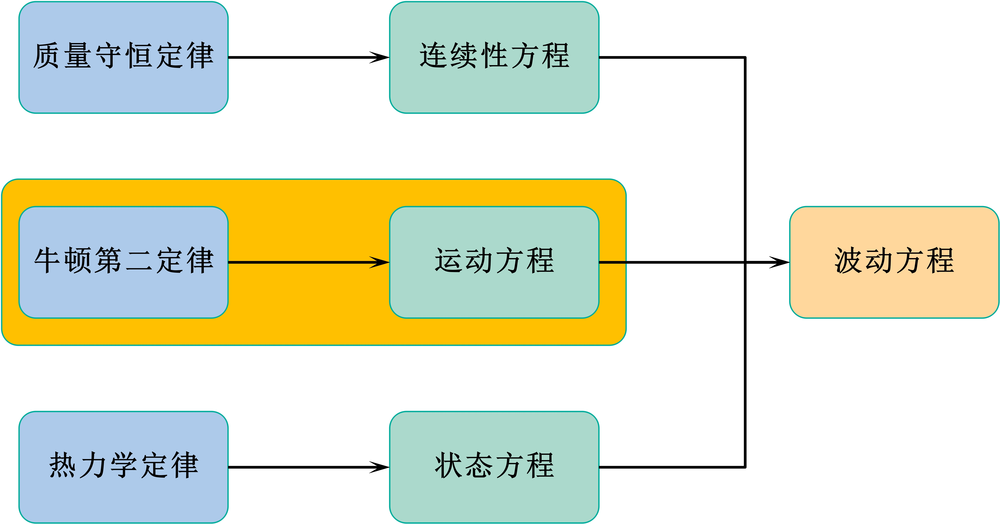

# 6 运动方程

**注意：本节中的所有关于质点振速（矢量场）、密度（标量场）的物理符号都表示场，它们都是空间和时间的函数，为了方便，只写前面的符号，后面关于空间和时间的符号 $(x, y, z, t)$ 省略。**

## 6.1 牛顿第二定律（动量守恒定律）

$$
\overrightarrow{F} = m \overrightarrow{a} = m \frac{d\overrightarrow{v}}{dt} = m \frac{d^2\overrightarrow{r}}{dt^2}
$$

## 6.2 运动方程推导（一）

介质中取一立方体质团，边长分别为 $dx、dy、dz$，质团中心 $M$ 点处的压强为 $P$。

### 6.2.1 压强产生的力分析

$X$ 方向面 $ADHE$ 的受力（泰勒展开并保留一阶项）：
$$
\overrightarrow{f_{x_1}}=P\left( x - \frac {dx} 2,y, z, t \right) \overrightarrow{i} = \left[ P + \frac{\partial P}{\partial x}\left( - \frac{dx}{2} \right) \right]dydz \overrightarrow{i}
$$
$X$ 方向面 $BCGF$ 的受力为（泰勒展开并保留一阶项）：
$$
\overrightarrow{f_{x_2}}=-P\left( x + \frac {dx} 2,y, z, t \right) \overrightarrow{i} = -\left[ P + \frac{\partial P}{\partial x} \frac{dx}{2} \right]dydz \overrightarrow{i}
$$
$X$ 方向的合力为：
$$
\overrightarrow{F_x} = \overrightarrow{f_{x_1}} + \overrightarrow{f_{x_2}} = -\frac{\partial P}{\partial x} dx dy dz \overrightarrow{i}
$$
同理可得 $Y$ 方向和 $Z$ 方向的合力为：
$$
\overrightarrow{F_y}  = -\frac{\partial P}{\partial y} dx dy dz \overrightarrow{j}\\
\overrightarrow{F_z}  = -\frac{\partial P}{\partial z} dx dy dz \overrightarrow{j}
$$
则质团受到的合力为：
$$
\overrightarrow{F} = \overrightarrow{F_x} + \overrightarrow{F_y} + \overrightarrow{F_z} \\
= - \left( \frac{\partial P}{\partial x}\overrightarrow{i} + \frac{\partial P}{\partial y}\overrightarrow{j} + \frac{\partial P}{\partial z}\overrightarrow{k} \right)dxdydz = -\nabla P dxdydz
$$

### 6.2.2 质点振速产生的力分析

根据牛顿第二定律：
$$
\overrightarrow{F} = \rho_t dxdydz \cdot \frac{d \overrightarrow{U}}{dt}
$$

### 6.2.3 运动方程

$$
(6) = (7) \Rightarrow -\nabla P = \rho_t \frac{d \overrightarrow{U}}{dt}
$$

## 6.3 运动方程推导（二）[^1]

在介质中取一立方体，压强的变化一定会导致介质的流动，反过来介质的流动也会导致压强的变化，$\frac{\partial P}{\partial x}dx$ 表示 $X$ 方向的压强差，则 $X$ 方向压强的变化量为：
$$
\overrightarrow{F_x}= -\frac{\partial P}{\partial x} dxdydz \overrightarrow{i}
$$
同理可得 $Y$ 方向和 $Z$ 方向的压强变化量，如式（5）所示。则质团所受合力如式（6）所示。

由于压强变化引起的质点振速变化产生的力表示为式（7），可得运动方程（8）。

---

**你一定会疑惑：**

**1. 压强为什么是直线变化的？**

> 因为质量元是很小的立方体，而且还有压强的变化。考虑导数的定义
> $$
> f'(x) = \lim_{x_2 \to x_1} \frac{f(x_2) - f(x_1)}{x_2 - x_1}
> $$
> 当 $x_2 \to x_1$ 时，斜率和导数是无限趋近的。所以可以将质量流速的变化考虑为线性变化。

**2. 压强的变化率为什么是负的？**

> 其实压强的变化率是负的还是正的，对于结果是没有影响的。压强变化率为负，（6）式为负，表明立方体所受合力为负，表明立方体内沿坐标轴正向方向压强减小，使得质团的加速度沿坐标轴正向（由压强大指向压强小），（7）式为正；压强的变化率为负，（6）式为正，表明立方体内沿坐标轴正向方向压强增大，使得质团的加速度沿坐标轴负向（由压强大指向压强小），（7）式为负。所以对最后的结果是没有影响的。

## 5.4 使用基本声学量表示运动方程

**基本声学量包括三个：声压（$p$）、质点振速（$\overrightarrow{u}$）、密度逾量（$\rho$）**。
$$
P = P_0 + p \\
\overrightarrow{U} = \overrightarrow{U_0} + \overrightarrow{u} \\
\rho_t = \rho_0 + \rho
$$
其中，$P$ 表示受到声场干扰后的总声压；$P_0$ 表示无声场情况下的声压；$p$ 表示受到声场干扰后产生的声压差；$\overrightarrow{U}$ 表示受到声波扰动后的总质点振速；$\overrightarrow{U_0}$ 表示无声波情况下的质点振速 $\overrightarrow{U_0} = 0$；$\overrightarrow{u}$ 表示受到声波扰动后的质点振速；$\rho_t$ 表示受到声波扰动后的介质密度，$\rho_0$ 表示无声波扰动时的介质密度，根据假设条件可知，其为某一常数，表示常量场；$\rho$ 表示受到声波扰动后的介质密度变化量。其中 $\overrightarrow{u}、\rho$ 都是小量，小量和小量的乘积可以忽略不计。
$$
-\nabla P = \rho_t \frac{d\overrightarrow{U}}{dt} \Rightarrow -\nabla(P_0 + p) = (\rho_0 + \rho) \frac{\partial \left( \overrightarrow{U_0} + \overrightarrow{u} \right) }{\partial t} \\
\Rightarrow -\nabla p = \rho_0 \frac{\partial \overrightarrow{u}}{\partial t}
$$
因为 $P_0$ 是一个常量场，所以它的梯度是零；$\overrightarrow{U_0} = 0$；$\rho$ 与 $\frac{\partial \overrightarrow{u}}{\partial t}$ 都是小量，两者的乘积为零。

## 6.5 运动方程表示的物理意义

**运动方程，又称尤拉方程、欧拉方程，它的直白表示为：介质中质点的加速度与密度的乘积等于沿计算度方向的声压梯度的负值。其表示的物理意义为：当流体中具有压力变化（压力梯度）时，介质就会发生运动速度的变化。**

[^1]: H. Medwin, C. S. Clay. Fundamentals of Acoustical Oceanography. San Diego:  Academic Press, 1998.

