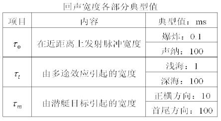

# 3 声呐方程

## 3.1 声呐方程

> [`声纳方程`](https://www.pmume.com/hjbk/nnc78.shtml)：声纳具有指定检测性能时输出信噪比与输入信噪比的关系式。
> `声纳方程`将海水介质、声纳目标和声纳设备联系在一起，定量地体现诸多参数之间的相互作用与制约。

声纳正常工作的基本要求是：**处理器处的电信号的信噪比达到检测阈。**

## 3.2 主动声呐的声呐方程

对于**收发合置**主动声呐，以**噪声为主要干扰**的声呐方程为：
$$
(SL - 2TL + TS) - (NL - DI) = DT
$$
对于**收发合置**主动声呐，以**混响为主要干扰**的声呐方程为：
$$
(SL - 2TL + TS) - RL = DT
$$
**对于收发分置声纳，往返传播损失不能简单地表示为 $2TL$**。

## 3.3 被动声呐的声呐方程

被动声纳的特点为：
1. 目标发出的噪声直接与目标传播至接收阵；
2. 无目标强度 $TS$；
3. 背景干扰为水下环境噪声。

被动声纳方程为：
$$
(SL - TL) - (NL - DI) = DT
$$

## 3.4 声呐方程的应用

1. 声纳设备性能预报
	（1）已知设备特点和若干参数，对其他声纳参数进行估计；
	（2）估计最大传播损失；
	（3）估计作用距离。
2. 声纳设备设计
	（1）预先规定所设计设备的职能及各项技术指标，根据声纳方程综合评价各参数的影响，对参数进行合理选取和设备最佳设计；
	（2）频率的选取 —— DI、TL。

## 3.5 声呐方程的限制

1. 声纳方程式用声强来描述的，而声强是声能流在某一段时间间隔内的平均 $I = \frac{1}{T}\int_0^T pudt$ ；
2. 对于长脉冲信号，回拨信号的宽度很接近发射信号脉动宽度；
3. 对于短脉冲信号，回拨信号波形严重畸变，平均值不确定。

对于短脉冲信号要对其进行修正，其修正方法为：
$$
SL = 10 \lg E - 10 \lg \tau_e
$$
其中，$E$  表示能流密度 $E = \int_0^{\infty}pudt$；$\tau_e$ 表示回声脉冲宽度 $\tau_e = \tau_0 + \tau_t + \tau_m$。

回声宽度各部分的典型值为：

