# 4 发射换能器阵的指向性（一）

## 4.1 基本概念

> `指向性函数(Direction Function)、波束响应函数(Directional Response)、指向性(Direction)`：声源前充分远处任意一点声压 $p(r, \theta, \phi)$  与声源轴线（最大响应轴，Maximum Response Axis, MRA）上同距离处声压 $p_{max}(r)$ 之比。
> $$
> R(\theta, \phi) = \left| \frac{p(r, \theta, \phi)}{p_{max}(r)} \right|
> $$

> `功率波束响应(Power Beam Pattern Response)、指向性模式(Directivity Pattern)`：某一频率下，声源前充分远处任意一点声强与最大响应轴上同距离处声强之比。
> $$
> D(\theta, \phi) = \frac{I(\theta, \phi, r)}{I(r)} =  R^2(\theta, \phi)
> $$

> 以分贝来描述称为`波束模式校正(Beam Pattern Correction，BPC)`[^1]，也叫波束方向性图(beam Pattern，BP)。
> $$
> BPC = 10 \lg (D(\theta, \phi)) = 20 \lg (R(\theta, \phi))
> $$

> `主瓣宽度、全开角` $\Theta$：主极大两侧第一个极小值之间的夹角。

> `束宽、波束宽度(beamwidth)、半功率角 ` $\Theta_{-3dB}$：由主极大的幅值下降 0.707 倍处两边的夹角或半功率辐射点之间的夹角。

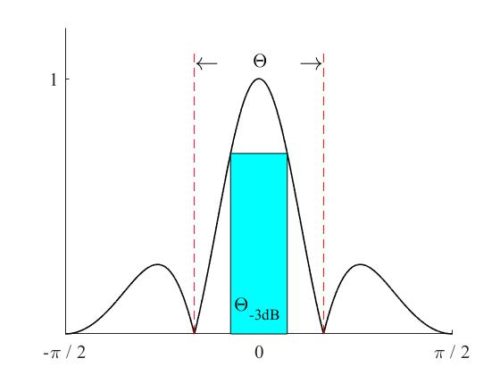

<b>图1 束宽和主瓣宽度图</b>

> `阵列指向性增益(Array Directivity Gain)、发射方向性因子`：在发射阵远场最大响应方向上的声强与同一距离处各方向声强的平均值之比。
> $$
> G_d = \frac{I_{max}}{\frac{1}{4\pi} \int I_{max}|R(\theta, \phi)|^2d\Omega} \\
>  = \frac{4\pi}{\int_0^{2\pi} \int_0^{\pi} |R(\theta, \phi)|^2 \cos \theta d\theta d\phi}
> $$

> `发射指向性指数`：发射阵的方向性因子的分贝数。
> $$
> DI_T = 10 \lg G_d
> $$

## 4.2 均匀点源离散直线阵

### 4.2.1 阵元同步激发

均匀点源离散直线阵示意图如图2所示。

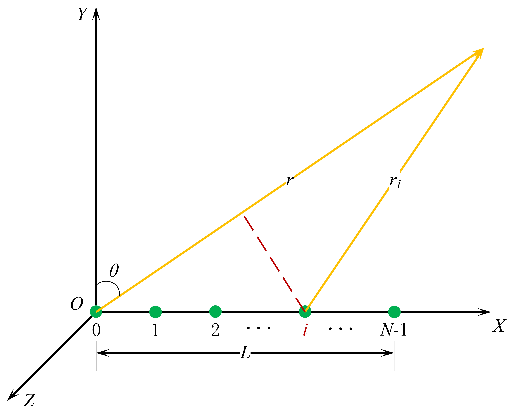

<b>图2 均匀点源离散直线阵</b>

单个点声源的辐射声压为：
$$
p(r, t) = \frac{jk \rho_0 c_0 Q}{4 \pi r} e^{j(\omega t - kr)}
$$
所有阵元在空间中一点的总声压可表示为：
$$
P = \sum_{i = 0}^{N - 1}p_i = \frac{jk \rho_0 c_0 Q}{4 \pi} \frac{e^{(\omega t - kr_i)}}{r_i}
$$
由图2可以知道，$r_i \approx r - id\sin\theta$，距离差导致声波相位差。但对于分子的 $r_i$ 来说，因为 $r \gg L$，所以 $r_i \approx r$。所以式（7）可以化简为：
$$
P = \frac{jk \rho_0 c_0 Q}{4 \pi r} e^{j(\omega t - kr)} \sum _{i = 0}^{N - 1}e^{jkid\sin\theta} = \frac{jk \rho_0 c_0 Q}{4 \pi r} e^{j(\omega t - kr)} \cdot R(\theta)
$$
波束响应函数 $R(\theta)$ 表示为：
$$
R(\theta) = \sum _{i = 0}^{N - 1}e^{jkid\sin\theta} = 
\frac{\sin \left( \frac{N \pi d \sin \theta}{\lambda}\right)}{\sin \left( \frac{\pi d \sin\theta}{\lambda}\right)} e^{j\phi}
$$
波束响应归一化后表示为：
$$
R(\theta) = 
\left|
\frac{\sin \left( \frac{N \pi d \sin \theta}{\lambda}\right)}{N\sin \left( \frac{\pi d \sin\theta}{\lambda}\right)}
\right|
$$
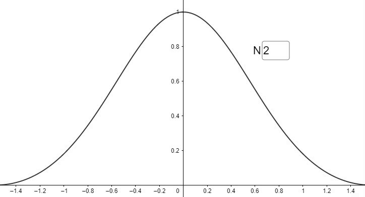

<b>图3 波束相应图</b>

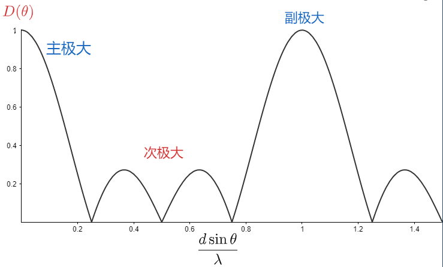

<b>图4 指向性图</b>

由式（10）和图4可以看出：

> 1. 当 $d \sin \theta = i \lambda, \ i = 0, 1, \cdots$  时，声压振幅出现极大值，出现极大值的位置  $\theta = \arcsin \left( \frac{i \lambda}{d} \right), \ \ d \ge i \lambda$。
>     当 $i = 0$  时的主极大称为 **`主瓣`**，其他副极大称为 **`栅瓣`**。
>
>   
>
>   **不出现副极大（栅瓣）的条件为：$d < \lambda$**。
>
> 2. 当  $Nd\sin \theta = \frac{2i + 1}{2}\lambda, \ i = 1, 2, \cdots$  时，声压振幅出现次极大 **`旁瓣`** ，旁瓣的位置位于 $\theta = \arcsin \left( \frac{2i + 1}{2Nd}\lambda \right)$ 。 
>
>    各次极大声压振幅与主极大声压振幅之比为：
>    $$
>    \frac{1}{N \sin \left( \frac{2i + 1}{2} \frac{\pi}{N} \right)}
>    $$
>    
>
>    `主旁瓣比`：主极大与第一次极大比值的分贝数。表示为 
> $$
>    20 \lg \left[ N \sin \left(\frac{3\pi}{2N}\right)\right]
> $$
>    当 $N \to \infty$  时，
> $$
> -\lim_{N \to \infty} 20 \lg \left[ N \sin \left(\frac{3\pi}{2N}\right)\right]\approx -13.5 \ \ \mathrm{dB}
> $$

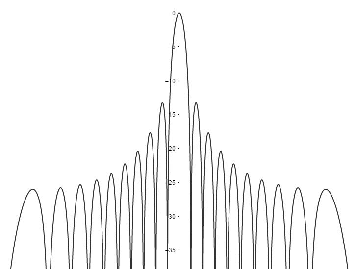

<b>图5 BPC图</b>

> 3. 当 $Nd\sin \theta = i\lambda, \ \ i \ne N$  时，声压振幅出现极小值或空值，极小值位于 $\theta = \arcsin \left( \frac{i \lambda}{Nd} \right)$。
>
>    主瓣宽度可表示为：
>    $$
>    \Theta = 2 \arcsin\left( \frac{\lambda}{Nd} \right)
>    $$

<b>图6 三维BPC图</b>

### 4.2.2 阵元异步激发

假设想做一个均匀点源直线离散阵，但是想要其主瓣的方向不在 0° 方向上，怎么办呢？如果所有阵元同时激发，那么其主瓣方向只能位于 0° 方向，所以需要阵元间异步激发。那么阵元间激发的时间差或者相位差控制在多少呢？

如图7所示，预设的主瓣方向为 $\theta_0$，阵元为 $1, 2, \cdots, i, \cdots, N - 1$，也就是当阵元分别位于 $1', 2', \cdots, i', \cdots, N - 1'$ 时，即可产生主瓣位于 $\theta_0$ 的波束相应函数。

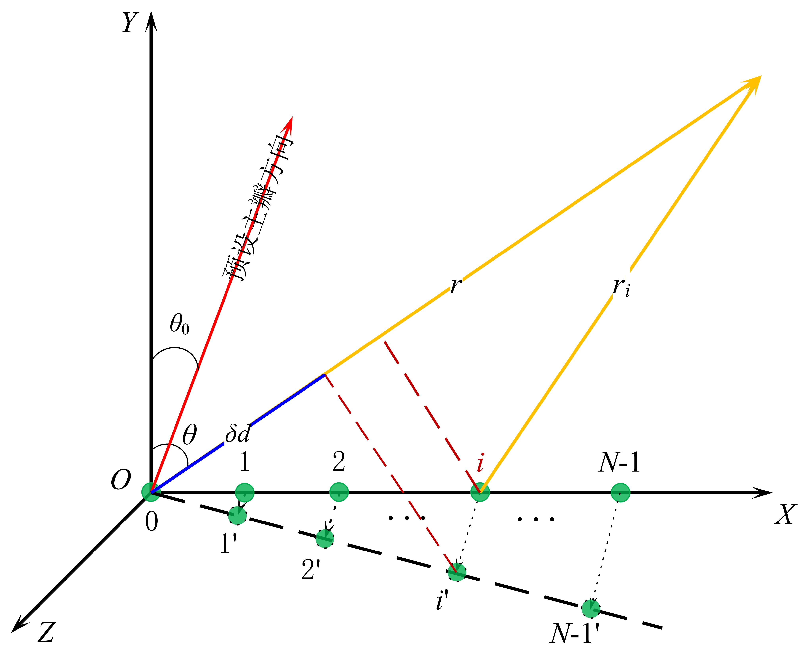

<b>图7 有指向性的均匀点源离散直线阵</b>

阵元同步激发时，相邻阵元在传播路径上的距离差为 $\Delta d = -d\sin \theta$。在远场看，声线 $r, r_i$ 基本上是平行的，且 $r \gg L$，所以 $ii'$与 $r$ 大致平行，则 $\delta d = -d(\sin \theta - \sin \theta_0)$。
因此波束响应函数可表示为：
$$
R(\theta) = \sum_{i = 0}^{N - 1}e^{jkid(\sin \theta - \sin \theta_0)}
$$
归一化之后可表示为：
$$
\left| R(\theta)  \right| = \left|\frac{\sin \left( \frac{N \pi d (\sin \theta - \sin \theta_0)  }{\lambda} \right) }{N \sin \left( \frac{\pi d (\sin \theta - \sin \theta_0)}{\lambda} \right)} \right|
$$
虽然推导出波束响应函数，但是怎么理解呢？其实很简单，根据公式（15）我们可以看出，$kd \sin \theta$ 为阵元同步激发时远场某点接收到的相邻阵元声压的相位差，$kd \sin \theta_0$ 就是相邻阵元之间异步激发时的相位差，相邻阵元之间激发时间差为 $\delta t = d \sin \theta_0 / c$。

根据阵元之间的相位差直接写出远场某点的声压为：
$$
P_{\theta_0} = \frac{jk \rho_0 c_0 Q}{4 \pi r} e^{j(\omega t - kr)} \sum _{i = 0}^{N - 1}
\left( 
	e^{jkid\sin\theta} \cdot e^{-jkid\sin \theta_0}
\right) \\
= \sum _{i = 0}^{N - 1} P \cdot e^{-jkid\sin \theta_0}
$$
图8显示了当波束角变化时波束响应函数的变化情况。

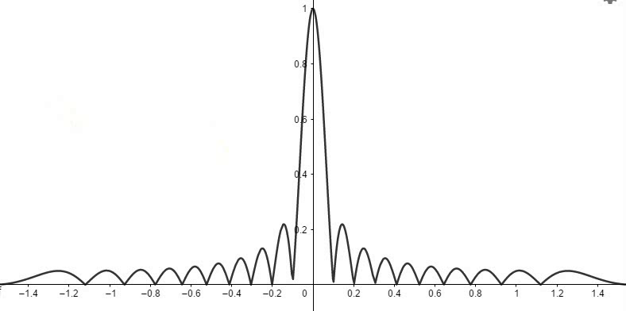

<b>图8 指向角变化时波束响应函数变化图</b>

从图8中可以看出，当指向角变大时，主瓣的宽度逐渐变大。其实这很好理解，所有的波束都进行了平移，主瓣的位置占据了原来旁瓣的位置，所以旁瓣宽度增大了。但是在 0° 方向的旁瓣大小却是同步激发时主瓣大小的一半。

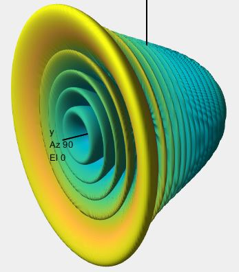

<b>图9 30°指向角BPC图</b>

三维波束指向图是二维波束指向图沿直线阵列旋转所得（因为波束响应函数与方位角 $\phi$ 无关）。所以当波束指向角不为零度时，主瓣形状为一个以直线阵列为轴线的圆锥体。

## 4.3 均匀连续直线阵

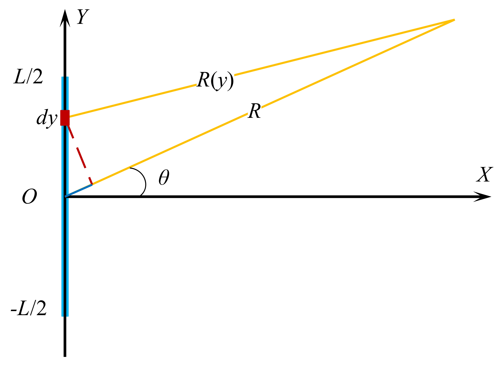

<b>图10 均匀连续直线阵</b>

均匀直线阵上的某一长度 $dy$ 在远场产生的声压为正比于整个阵列所在产生的声压，所以
$$
dp = \frac{dy}{L} \cdot \frac{jk \rho_0 c_0 Q}{4 \pi R(y)} e^{j(\omega t - kR(y))} \\
= \frac{1}{L}\cdot \frac{jk \rho_0 c_0 Q}{4 \pi R} e^{j(\omega t - kR)} \cdot e^{jky\sin \theta}dy
$$
远场某点处的辐射声压为：
$$
P = \frac{1}{L}\cdot \frac{jk \rho_0 c_0 Q}{4 \pi R} e^{j(\omega t - kR)} \int_{-\frac{L}{2}}^{\frac{L}{2}} e^{jky\sin \theta}dy \\
= \frac{jk \rho_0 c_0 Q}{4 \pi R} e^{j(\omega t - kR)} \cdot \frac{\sin \left( 
	k \frac{L}{2} \sin \theta
\right)}{k\frac{L}{2} \sin \theta}
$$
则波束响应函数为:
$$
|R(\theta)| = \left| \frac{\sin \left( k \frac{L}{2} \sin \theta \right)}{k\frac{L}{2} \sin \theta} \right|
$$
若设 $x = k\frac{L}{2} \sin \theta$，则波束响应函数可表示为 $\left|\frac{\sin x}{x} \right|$，这是[辛格（sinc）函数](https://baike.baidu.com/item/sinc%E5%87%BD%E6%95%B0/5952485?fr=aladdin)。

观察式（10）与式（20），可以看出
$$
\lim_{\substack{d \to 0 \\ N \to \infty \\ Nd \to L}} \left| 
	\frac{\sin\left( \frac{N \pi d \sin \theta}{\lambda} \right)}{N \sin \left( \frac{\pi d \sin \theta}{\lambda} \right)} 
\right| = \left| \frac{\sin \left( k \frac{L}{2} \sin \theta \right)}{k\frac{L}{2} \sin \theta} \right|
$$
**连续直线阵不会出现栅瓣。**

连续直线阵的主瓣宽度为 
$$
\Theta = 2\arcsin \left( \frac{\lambda}{L} \right)
$$
连续直线阵的束宽为
$$
\Theta_{-3dB} = 2\arcsin \left(0.42 \frac{\lambda}{L} \right)
$$
发射方向性因子可表示为：
$$
G_d = \int_{-\pi}^{\pi}d\phi \int_{-\frac{\pi}{2}}^{\frac{\pi}{2}}
\left[
	\frac{\sin \left( k \frac{L}{2} \sin \theta \right)}{k \frac{L}{2} \sin \theta}
\right]^2 \cos \theta d \theta \\
= 2\pi \int_{-1}^1 
\left[
	\frac{\sin \left( k \frac{L}{2} u \right)}{k \frac{L}{2} u}
\right]^2 du \\
= 2 \pi \frac{2}{kL}\int_{-\infty}^{\infty}\left( \frac{\sin \ v}{v} \right)^2 dv \approx \frac{4 \pi^2}{kL}
$$
发射指向性指数可表示为
$$
DI_T = 10 \lg \frac{4 \pi}{G_d} = 10 \lg \left( \frac{2L}{\lambda} \right)
$$

## 4.4 平面圆形活塞辐射器

> 半径为 $a$  的圆形平面活塞镶嵌在无限大挡板上，活塞位于 $XOY$ 平面内，向上半空间辐射声波，声场对称于 $z$ 轴，活塞表面各点的振幅和相位相同。

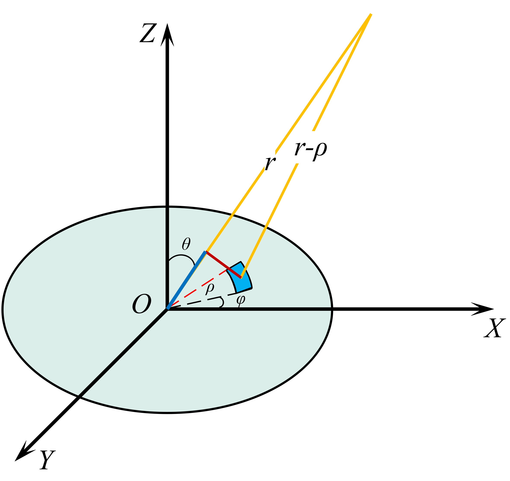

<b>图11 平面圆形活塞辐射器</b>

根据图11，可列出远场某点声压可表示为：
$$
P = \frac{jk \rho_0 c_0 u_z}{2\pi}e^{j\omega t} \iint_S \frac{-e^{jk|\overrightarrow{r} - \overrightarrow{\rho}|}}{|\overrightarrow{r} - \overrightarrow{\rho}|}dS
$$
圆形活塞辐射器上任意一点到远场与圆心到远场一点的差值可表示为：
$$
|\overrightarrow{r} - \overrightarrow{\rho}| - |\overrightarrow{r}| \approx \rho \cos 
\langle r, \rho \rangle = \rho \sin \theta \cos \phi
$$

所以式（26）可以简写为：
$$
P = \frac{jk \rho_0 c_0 u_z}{2\pi r}e^{j(\omega t - kr)} \int_0^a \rho d \rho \int_0^{2 \pi}e^{jk\rho \sin \theta \cos \phi}d \phi
$$
根据第一类贝塞尔函数
$$
J_0(\alpha) = \frac{1}{2\pi}\int_0^{2\pi}e^{j \alpha \cos \phi} d\phi \\
\beta J_1(\beta) = \int_0 ^{\beta}\alpha J_0(\alpha) d\alpha
$$
令 $x = k\rho \sin \theta$，式（28）可以写成
$$
P = \frac{jk \rho_0 c_0 u_z}{2\pi r}e^{j(\omega t - kr)} \cdot 2 \pi \int_0^a \rho J_0(x) d \rho  \\
= \frac{jk \rho_0 c_0 u_z a^2}{2 r}e^{j(\omega t - kr)} \cdot \frac{2J_1(x)}{x}
$$
**根据式（30）可以看出，平面圆形活塞辐射器的远场声压和球面波一样，都是与距离成反比。** 

> 当 $ka < 1$  时， $J_1(x) \approx x /2$，此时，$D(\theta) \approx 1$，即当活塞尺寸相对于介质中的波长来说很小时，辐射几乎是各向均匀的。
> 随着 $ka$ 值的增大，即随着活塞尺寸的加大或辐射频率的提高，指向性越来越尖锐。

不同 $ka$ 参数下波束的指向性图如图12所示。

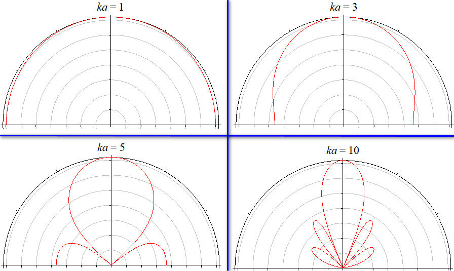

<b>图12 不同ka参数下的指向图</b>

当 $ka$  值超过一阶贝塞尔函数的第一个根值 3.83 以后，辐射开始具有更为复杂的指向性。当 $\theta = \arcsin \frac{3.83}{ka} = \arcsin\left( 061 \frac{\lambda}{a} \right)$ 时， $D = 0$，辐射为 0，超过这个角度，辐射逐渐增加，并在某个角度达到次极大，此后辐射又逐渐减小，从而在指向图上就表现为除主瓣以外还会出现一些旁瓣，如图11中 $ka = 5$ 所示。

**过渡距离为：$z_g = \frac{a^2}{\lambda}$**。

> 平面圆形活塞辐射器的主瓣宽度为：
> $$
> \Theta = 2\arcsin \left( 0.61\frac{\lambda}{a} \right)
> $$
> 平面圆形活塞辐射器的束宽为：
> $$
> \Theta_{-3dB} = 2 \arcsin \left( 0.26 \frac{\lambda}{a} \right)
> $$

发射方向性因子可表示为：
$$
G_d = k^2 a^2 \left[ 1 - \frac{2J_1(2ka)}{2ka} \right]^{-1}
$$
发射指向性指数可表示为：
$$
DI_T = 20 \lg(ka) = 20 \lg \left( \frac{2\pi a}{\lambda} \right)
$$
平面圆形活塞辐射器的三维指向图如图13所示[^2]。

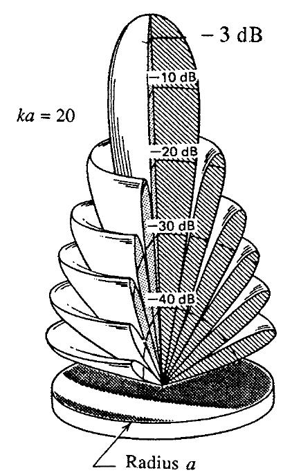

<b>图13 平面圆形活塞辐射器三维指向图</b>

----

## 附录

### 附录1 $f(\theta) = \sum_{i = 0}^{N - 1}e^{jkid\sin \theta} = ?$

问题可以简化为：
$$
f(x) = \sum_{n = 0}^{N - 1}e^{jnx} = \sum_{i = 0}^{N - 1}\cos(nx) + j \sum_{i = 0}^{N - 1}\sin(nx), \ \ \ \ \ \ x = kd\sin \theta
$$
假设 $A \equiv \sum_{i = 0}^{N - 1}\cos(nx), \ B \equiv \sum_{i = 0}^{N - 1}\sin(nx) $，则
$$
A \equiv 1 + \cos(x) + \cos(2x) + \cdots + \cos((N - 1)x) \\
= \frac{\sin \frac{x}{2} + \cos(x) \cdot \sin \frac{x}{2} + \cdots + \cos((N - 1)x) \cdot \sin \frac{x}{2}}{\sin \frac{x}{2}} \\
\\
B \equiv 1 + \sin(x) + \sin(2x) + \cdots + \sin((N - 1)x) \\
= \frac{\sin(x) \cdot \sin \frac{x}{2} + \cdots + \sin((N - 1)x) \cdot \sin \frac{x}{2}}{\sin \frac{x}{2}}
$$
根据积化和差公式 $\cos \alpha \cdot \sin \beta = \frac{1}{2}\left[ \sin (\alpha + \beta) - \sin(\alpha - \beta) \right]$ 和 $\sin \alpha \cdot \sin \beta = -\frac{1}{2} \left[\cos(\alpha + \beta) - \cos(\alpha - \beta) ) \right]$。
$$
A = \frac{\sin \frac{x}{2} + \sin \frac{2N - 1}{2}x} {2 \cdot \sin \frac{x}{2}} \\
B = \frac{\cos \frac{x}{2} - \cos \frac{2N - 1}{2}x}{2 \cdot \sin \frac{x}{2}}
$$
根据和差化积公式 $\sin \alpha + \sin \beta = 2 \sin \frac{\alpha + \beta}{2}\cos \frac{\alpha - \beta}{2}$ 和 $\cos\alpha - \cos \beta = -2\sin \frac{\alpha + \beta}{2} \sin \frac{\alpha - \beta}{2}$。
$$
A = \frac{\sin \frac{Nx}{2}}{\sin \frac{x}{2}} \cdot \cos \frac{(N - 1)x}{2} \\
B = \frac{\sin \frac{Nx}{2}}{\sin \frac{x}{2}} \cdot \sin \frac{(N - 1)x}{2}
$$
则 $f(x) = \sum_{n = 0}^{N - 1}e^{jnx} = A + jB = \frac{\sin \frac{Nx}{2}}{\sin \frac{x}{2}} e^{j \phi}, \ \ \ \phi = \frac{N - 1}{2}x$。
$$
f(\theta) = \sum_{i = 0}^{N - 1}e^{jkid\sin \theta} = \frac{\sin \left( \frac{N \pi d \sin \theta}{\lambda}\right)}{\sin \left( \frac{\pi d \sin\theta}{\lambda}\right)} e^{j\phi}
$$
当 $d$ 足够小时，即 $x$足够小，则
$$
|f(x)| = \left| \frac{\sin \frac{Nx}{2}}{\sin \frac{x}{2}} \right| = N \cdot \left|
\frac{\sin \frac{Nx}{2}}{N \cdot \frac{x}{2}}
\right|
$$
其中，$\frac{\sin \frac{Nx}{2}}{N \cdot \frac{x}{2}}$ 为辛格函数 $\mathrm{sinc}(\frac{Nx}{2})$。

对于 辛格函数，当取 $\mathrm{sinc}(\frac{Nx}{2}) = 0.707 (\frac{Nx}{2} = 1.39)$ 时，得到天线波瓣的半功率点位，可以算出天线的 $-3 \ \mathrm{dB}$ 波束宽度 $\theta_{-3 dB}$ 为
$$
\theta_{-3dB} = \frac{1}{\cos \theta_B}\cdot \frac{51 \lambda}{Nd}(\circ)
$$
由此可知，波束宽度 $\theta_{-3dB}$ 与阵列的长度 $Nd$ 成反比，即线阵越大，其波束越窄。若取 $d = \lambda / 2$，则
$$
\theta_{-3dB} \approx \frac{1}{\cos \theta_B} \cdot \frac{1.76}{N} (rad) \\
\theta_{-3dB} \approx \frac{1}{\cos \theta_B} \cdot \frac{101}{N}(\circ)
$$
所以在多波束中，当已知波束角无偏转时的角度大小时 $\theta_0$，可直接通过下式计算偏转角度为 $\theta_B$ 时的束宽为
$$
\theta_{-3dB} \approx \frac{1}{\cos {\theta_B}} \cdot \theta_0
$$

### 附录2 为什么连续直线阵的束宽为 $2\arcsin \left( 0.42 \frac{\lambda}{L} \right)$

令 $x = \frac{kL\sin \theta}{2} = \frac{\pi L \sin \theta}{\lambda}$，则连续直线阵的波束响应函数可以表示为
$$
|R(\theta)| = \left| \frac{\sin x}{x} \right|
$$
根据泰勒展开公式 $\sin x = 1 - \frac{x^3}{3!} + o(x^3)$，则 $\frac{\sin x}{x} = 1 - \frac{x^2}{6} + o(x^2)$，根据束宽的定义可得
$$
\frac{\sin x}{x} = 1 - \frac{x^2}{6} = \frac{1}{\sqrt{2}} \approx 1.326
$$
则
$$
\frac{\pi L \sin \Theta_{-3dB}}{\lambda} = 1.326  \ \ \ \ \Rightarrow \Theta_{-3dB} = \arcsin \left( 0.42 \frac{\lambda}{L} \right)
$$

### 附录3 平面圆形活塞辐射器的声场特性推导

选取活塞中心为坐标原点，过中心的轴线为 $z$ 轴， 先计算轴线上坐标为 $z$ 的位置上的声压。
设想在活塞上选取选取一内径为 $\rho$ 外径为 $\rho + d\rho$ 的圆环，由于 $d\rho$ 极其微小，可以认为圆环上所有点到 $z$ 点的距离 $h = \sqrt{\rho^2 + z^2}$，因此圆环上所有点源辐射的声波到达 $z$ 处时，其振幅相等、相位相等。
$$
dp = j \frac{k \rho_0 c_0}{2 \pi h} u_z dS e^{j(\omega t - kh)}, \ \ \ dS = 2 \pi \rho d \rho \\
\Downarrow \\
p = jk \rho_0 c_0 u_z e^{j \omega t} \int_0 ^a \frac{e^{-jkh}}{2 \pi h} 2\pi \rho d \rho
$$
因为 $h = \sqrt{\rho^2 + z^2}$，可以推导出 $\rho d \rho = h dh$。
$$
p = jk \rho_0 c_0 u_z e^{j\omega t} \int_z^R e^{-jkh}dh \\
\Downarrow \\
p = 2 \rho_0 c_0 u_z \sin \frac{k(R - z)}{2}e^{j \left[ \omega t - \frac{k}{2}(R + z) + \frac{\pi}{2} \right]}, \ \ \ \ R = \sqrt{a^2 + z^2}
$$
根据泰勒展开式 $\sqrt{1 + x^2} = 1 + \frac{x^2}{2} + o(x^2)$，可以得到 $\sin \frac{k(R - z)}{2} \approx 1 + \frac{a^2}{2z} = \sin \frac{\pi}{2} \frac{z_g}{z}$，$z_g = a^2 / \lambda$。
跟 $z$ 有关的项为 $\sin \frac{k(R - z)}{2}$，其大致图像为如图图14所示。

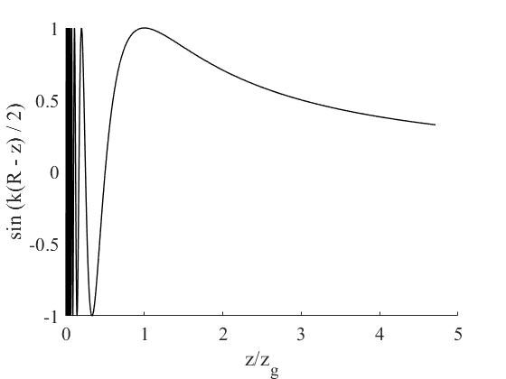

<b>图14 平面圆形活塞辐射器声压与距离关系图</b>

由公式和图14可以看出，过渡距离为：$z_g = a^2 \lambda$。

[^1]: Hodges R P. Underwater acoustics: Analysis, design and performance of sonar[M]. John Wiley & Sons, 2011.
[^2]: Medwin H, Clay C S. Fundamentals of Acoustical Oceanography[M]. San Diego: Academic Press, 1997, 147.

