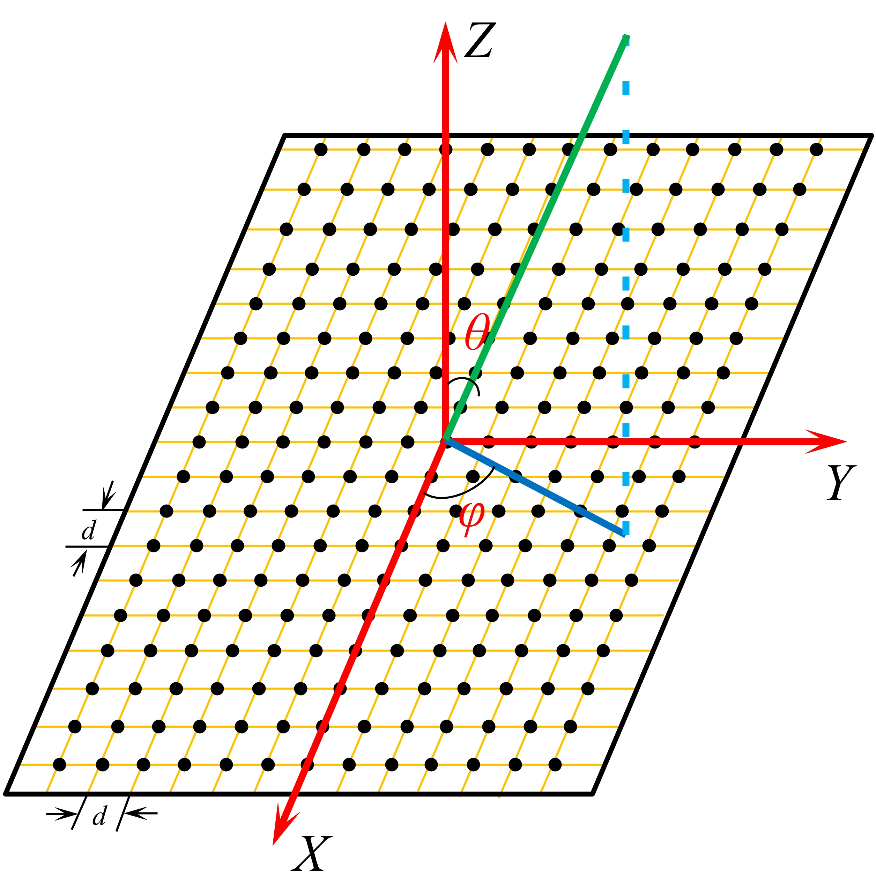
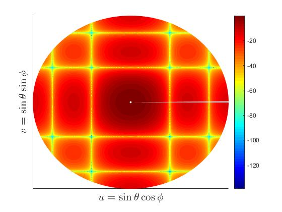
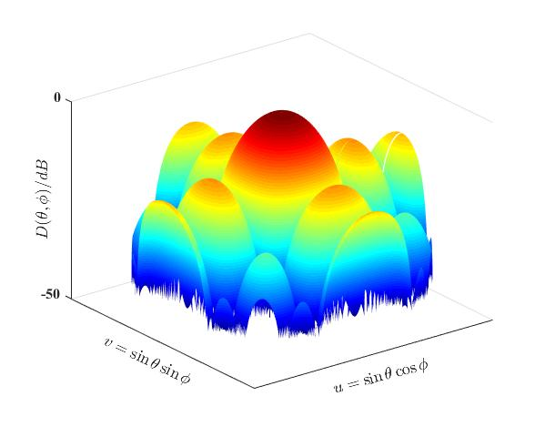
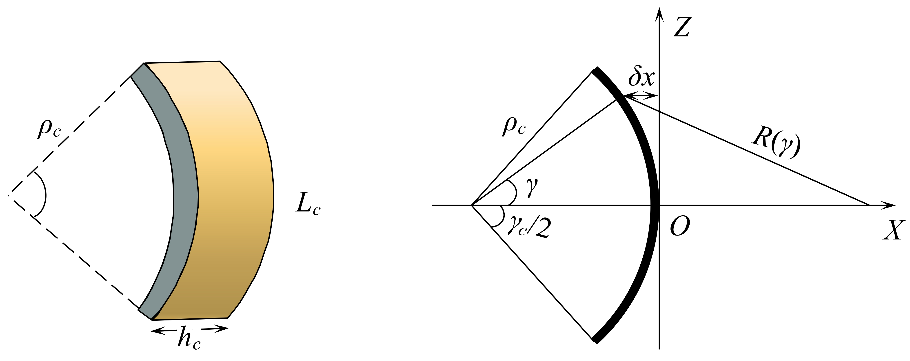

# 5 发射换能器阵的指向性（二）

## 5.5 矩形平面阵列

矩形平面阵列如下图所示。

一个点声源在远场形成的声压为：
$$
dp = \frac{jk\rho_0 c_0 Q}{4 \pi R} e^{jkd\sin \theta( m \cos \phi + n \sin \phi)}
$$
则矩形平面阵列在远场的声压为：
$$
P = \frac{jk\rho_0 c_0 Q}{4 \pi R} 
\sum_{m = -(M-1)/2}^{(M-1)/2} \sum_{n = -(N-1)/2}^{(N-1)/2} e^{jkd\sin \theta(m \cos \phi + n \sin \phi)} \\
= \frac{jk\rho_0 c_0 Q}{4 \pi R} \sum_{m = -(M-1)/2}^{(M-1)/2} e^{jkd\sin \theta \cdot m \cos \phi}  \sum_{n = -(N-1)/2}^{(N-1)/2}e^{jkd\sin \theta \cdot n \sin \phi} \\
= MN \cdot \frac{jk\rho_0 c_0 Q}{4 \pi R} \cdot \frac{\sin \frac{M \pi d \sin \theta \cos \phi}{\lambda}}{M \sin \frac{\pi d \sin \theta \cos \phi}{\lambda}} \cdot \frac{\sin \frac{N \pi d \sin \theta \sin \phi}{\lambda}}{N \sin \frac{\pi d \sin \theta \sin \phi}{\lambda}} \\
= MN \cdot \frac{jk\rho_0 c_0 Q}{4 \pi R} \cdot R_x(\theta, \phi) \cdot R_y(\theta, \phi)
$$
则矩形阵列的波束响应函数为：
$$
|R(\theta, \phi)| = |R_x(\theta, \phi) \cdot R_y(\theta, \phi)|
$$
其波束响应函数在 $x$ 方向、$y$ 方向与均匀点源离散直线阵波束响应函数相同，是两个方向波束响应函数的乘积。

矩形平面阵列的UV图如下图所示。

矩形平面阵列的三维指向图如下图所示。

## 5.6 圆柱形天线[^1]

圆柱型天线比线状天线要复杂一些，其示意图如下图所示。

如上图所示，其中圆柱型天线的半径为 $\rho_c$；曲线长 $L_c$；宽度为 $h_c$；天线孔径的角度大小为 $\gamma_c$，$L_c = \rho_c \gamma_c$。在沿 $h_c$ 方向上，圆柱型天线表现为长度为 $h_c$ 的线性连续直线阵的辐射模型。

根据上图右图，沿辐射轴向上，足够远处圆柱面上任意一点与中心点 $O$ 之间的路径差为：
$$
\delta x(\gamma) = \rho_c(1 - \cos \gamma) \approx \rho_c \frac{\gamma^2}{2}
$$
整个圆柱型天线在远场的辐射世家时角度 $\gamma$ 的积分，则
$$
p(R) = \frac{1}{L_c}\int_{-\frac{L_c}{2}}^{\frac{L_c}{2}} \frac{exp(-jkR(\gamma))}{R(\gamma)}ds \\
= \frac{\rho_c}{L_c}\int_{-\frac{L_c}{2}}^{\frac{L_c}{2}} \frac{exp(-jkR(\gamma))}{R(\gamma)}d \gamma \\
= \frac{\rho_c}{L_c} \frac{exp(-jkR_0)}{R_0} \int_{-\frac{L_c}{2}}^{\frac{L_c}{2}} exp
\left(
-jk\rho_c \frac{\gamma ^2}{2}
\right)d \gamma \\
= \frac{\rho_c}{L_c} \frac{exp(-jkR_0)}{R_0} \int_{-\frac{L_c}{2}}^{\frac{L_c}{2}} \cos 
\left(
k \rho_c \frac{\gamma^2}{2}
\right) d \gamma
$$
根据菲涅尔积分 $\int_0 ^{\infty} \cos(au^2)du = \frac{1}{2} \sqrt{\frac{\pi}{2a}}$，则辐射声压的模可表示为：
$$
|p(R)| \approx \frac{\rho_c}{L_cR_0} \sqrt{\frac{\pi}{k \rho_c}} = \frac{\rho_c}{L_cR_0} \sqrt{\frac{\lambda}{2\rho_c}} = \frac{1}{\gamma_c R_0}\sqrt{\frac{\lambda}{2\rho_c}}
$$
菲涅尔区拦截角度为：
$$
\gamma_F = 2 \sqrt{\frac{\lambda}{\rho_c}}
$$

---

## 附录

### 附录1 奇数项余弦函数的和

当 $M$ 为奇数时，
$$
f(x) = \sum_{t = -(M-1)}^{M-1} \cos tx
$$

$$
f(x) = \cos[(-M + 1)x] + \cos[(-M + 2)x] + \cdots + 1 + cos(x) + \cdots + \cos[(M-2)x] + \cos[(M-1)x]
$$

根据和差化积公式 $\cos \alpha + \cos \beta = 2 \cos\frac{\alpha + \beta}{2}\cos \frac{\alpha - \beta}{2}$ ，则 $f(x)$ 可简化为：
$$
f(x) = 1 + 2\left[\cos(x) + \cos(2x) + \cdots + \cos[(M-2)x] + \cos[(M-1)x]\right]
$$
根据积化和差公式 $2\cos \alpha \sin \beta = \sin(\alpha + \beta) - \sin(\alpha - \beta)$，则
$$
\frac{f(x)\sin\frac{x}{2}}{\sin\frac{x}{2}} = \frac{\sin\frac{x}{2} + \sin \frac{2M-1}{2}x - \sin \frac{2M-3}{2}x + \cdots + \sin \frac{5}{2}x - \sin\frac{3}{2}x + \sin \frac{3}{2}x - \sin\frac{1}{2}x}{\sin\frac{x}{2}} \\= \frac{\sin \frac{2M-1}{2}x}{\sin\frac{x}{2}}
$$
$2M - 1$ 为所有项数的和，假设为 $N$，且$x = kd \sin \theta$，并进行归一化，那么 
$$
\overline{f(x)} = \frac{\sin \frac{N \pi d \sin \theta}{\lambda}}{\sin\frac{\pi d \sin \theta}{\lambda}}
$$

### 附录2 偶数项余弦函数的和

当 $M$ 为偶数时，
$$
g(x) = \sum_{m = -M / 2 + 1}^{M / 2} \cos\left[ \frac{2m - 1}{2}x \right]
$$

$$
g(x) = \cos \left[ \frac{-M + 1}{2}x \right] + \cos \left[ \frac{-M + 3}{2}x \right] + \cdots + \cos \left[ -\frac{1}{2}x \right] + \cos \left[ \frac{1}{2}x \right] + \cdots + \cos \left[ \frac{M - 3}{2}x \right] + \cos \left[ \frac{M - 1}{2}x \right]
$$

根据和差化积公式 $\cos \alpha + \cos \beta = 2 \cos\frac{\alpha + \beta}{2}\cos \frac{\alpha - \beta}{2}$ ，则 $g(x)$可简化为：
$$
g(x) = 2\left[ \cos \left( \frac{M - 1}{2}x \right) + \cos \left( \frac{M - 3}{2}x \right) + \cdots + \cos \left( \frac{3}{2}x \right) + \cos \left( \frac{1}{2}x \right)\right]
$$
根据积化和差公式 $2\cos \alpha \sin \beta = \sin(\alpha + \beta) - \sin(\alpha - \beta)$，则
$$
\frac{g(x)\sin\frac{x}{2}}{\sin\frac{x}{2}} = \frac{\sin \left[\frac{M}{2}x \right] - \sin \left[\frac{M - 2}{2}x \right] + \sin \left[\frac{M - 2}{2}x \right] - \sin \left[\frac{M - 4}{2}x \right] + \cdots + \sin \left[2x \right] - \sin x  + \sin x }{\sin \frac{x}{2}} \\= \frac{\sin \frac{M}{2}x}{\sin \frac{x}{2}}
$$
$M$ 为所有求和项的系数，且 $x = kd \sin \theta$，并进行归一化，那么
$$
\overline{g(x)} = \frac{\sin \frac{M \pi d \sin \theta}{\lambda}}{\sin \frac{\pi d \sin \theta }{\lambda}}
$$
**由上面两种情况可以看出，不管余弦函数求和的项数是奇数还是偶数，其最终的结果是不变的，所以在 等间距线性阵列中直接可以按 $\sum_{m = 0}^{N} \cos mx$ 直接计算。** 

[^1]: Xavier Lurton. An Introduction to Underwater Acoustics: Principles and Applications[M]. Second Edition. Chichester: Springer-Praxis, 2010: 524-525.