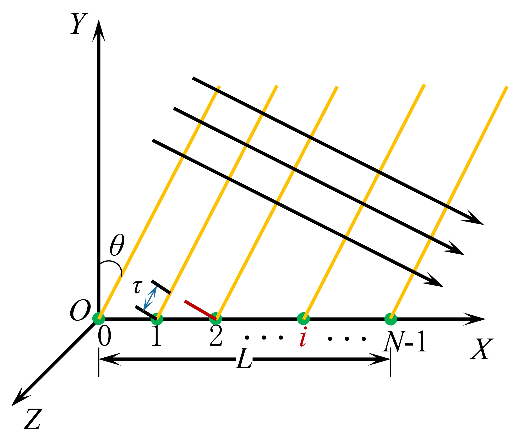
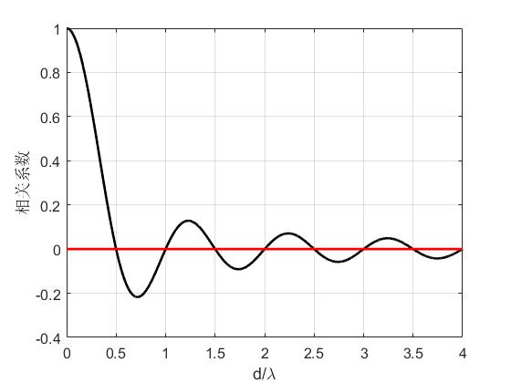

# 6 接收换能器的指向性和阵增益

## 6.1 接收换能器的指向性

> 设离接收系统参考中心的远场球面上有一点源，姐搜系统的输出电压 $V$ 与接收中心的方位有关，则 `接收系统指向性函数` 为
> $$
> R(\theta, \phi) = \left| \frac{V(\theta, \phi)}{V(0, 0)} \right|
> $$
> **根据互易原理，可逆换能器的接收阵指向性函数与它的发射指向性函数相同。**

> `接收方向性因子`：
> $$
> R = \frac{N_0}{N_d} = \frac{4\pi}{\int_{4\pi}R^2(\theta, \phi) d\Omega}
> $$

> `接收指向性指数`：
> $$
> DI = 10 \lg \left( \frac{N_0}{N_d} \right) = 10 \lg \left[ \frac{4\pi}{\int_{4\pi}R^2(\theta, \phi) d\Omega} \right] = NL_0 - NL_d
> $$
> **同一可逆换能器，其接收指向性指数和发射指向性指数相同。**

### 6.1.1 等间距均匀离散直线阵的指向性

等间距均匀离散直线阵接收器如下图所示。

相邻两阵元之间的时间差为 $\tau$，相位差为 $\phi$，则：
$$
\tau = \frac{d\sin \theta}{c} \\
\phi = kd \sin \theta
$$
假设每个阵元的输出信号分别为：
$$
S_0(t) = A Re\{e^{j\omega t}\} \\
\vdots \\
S_{N-1}(t) = A Re\{ e^{j \omega t }\cdot e^{j\phi_{N-1}} \}
$$
则等间距均匀离散直线阵接收器的输出信号为：
$$
S(\theta, t) = \sum_{i = 0}^{N-1}S_i(t) = A \cdot Re \left[ e^{j \omega t} \sum _{i = 0}^{N-1} e^{j \phi_i} \right]
$$
根据 [4-发射换能器阵的指向性（一）](./4-发射换能器阵的指向性（一）.md) 附录1，可以知道
$$
\sum_{i = 0}^{N-1}e^{j \phi_i} = \frac{\sin \left( \frac{N \pi d \sin \theta}{\lambda} \right)}{N \sin \left( \frac{\pi d \sin \theta}{\lambda} \right)} e^{j\xi}
$$
其中，$\xi = \frac{(N - 1)\phi}{2}$。

则输出信号为
$$
S(\theta, t) = A \frac{\sin \left( \frac{N \pi d \sin \theta}{\lambda} \right)}{N \sin \left( \frac{\pi d \sin \theta}{\lambda} \right)} \cos {\left[ \omega t + \frac{(N - 1)kd\sin \theta}{2} \right]}
$$
等间距均匀离散直线阵接收器的指向性函数为：
$$
\left| R(\theta) \right| = \left| \frac{\sin \left( \frac{N \pi d \sin \theta}{\lambda} \right)}{N \sin \left( \frac{\pi d \sin \theta}{\lambda} \right)} \right|
$$

### 6.1.2 [阵增益](http://www.doc88.com/p-0022544352688.html)

> `阵增益`：阵增益是指水听器阵从噪声背景下检测信号时，相对于单个水听器检测时信噪比改善程度的一种量度。基阵输出信噪比高于阵元输出信噪比的分贝数。
> $$
> AG = 10 \lg
> \left[
> 	\frac{\int_{4\pi} S(\theta, \phi) D(\theta, \phi) d\Omega / \int_{4\pi} N(\theta, \phi) D(\theta, \phi) d\Omega}{\int_{4\pi} S(\theta, \phi) d\Omega / \int_{4\pi} N(\theta, \phi) d\Omega}
> \right]
> $$
> 
>
> 对于单个没有指向性的阵元，$D(\theta, \phi) = 1$。
>
> 
>
> 假定目标信号是朝某一个方向辐射的远场相关平面波，且周围环境噪声是各项均匀同性的，即在各个方向上的噪声声强是一样的（$N(\theta, \phi) = 1$），当阵列声主轴与目标方向一致时，有 $\int_{4\pi} S(\theta, \phi)D(\theta, \phi) d\Omega = \int_{4\pi} S(\theta, \phi) d\Omega$，进而化简为[^1]
> $$
> AG = 10 \lg \left( \frac{4\pi}{\int_{4\pi} D(\theta, \phi) d\Omega } \right)
> $$
> **在上述情形下，阵增益与接收指向性指数是相同的。**

设 $m$ 个阵元输出电压的时间函数计入了转向而插入的相移或时延，记为 $s_1(t)、s_2(t)、\cdots、s_m(t)$，则基阵的输出电压为
$$
S_V = s_1(t) + s_2(t) + \cdots + s_m(t) 
$$
基阵输出端的平均信号功率为：
$$
S = k \overline{[s_1(t) + s_2(t) + \cdots + s_m(t)]^2}
$$
基阵输出端的平均噪声功率为：
$$
N = k \overline{[n_1(t) + n_2(t) + \cdots + n_m(t)]^2}
$$
基阵输出信号平均信噪比：
$$
\frac { S } { N } = \frac { ( \overline { \left( s _ { 1 } s _ { 1 } \right) } + \overline { \left( s _ { 1 } s _ { 2 } \right) } + \cdots + \overline { \left( s _ { 1 } s _ { m } \right) } ) + ( \overline { \left( s _ { 2 } s _ { 1 } \right) } + \overline { \left( s _ { 2 } s _ { 2 } \right) } + \cdots + \overline { \left( s _ { 2 } s _ { m } \right) } ) + \cdots } { ( \overline { \left( n _ { 1 } n _ { 1 } \right) } + \overline { \left( n _ { 1 } n _ { 2 } \right) } + \cdots + \overline { \left( n _ { 1 } n _ { m } \right) } ) + \left( \overline { \left( n _ { 2 } n _ { 1 } \right) } + \overline { \left( n _ { 2 } n _ { 2 } \right) } + \cdots + \left( n _ { 2 } n _ { m } \right) \right) + \cdots }
$$
相关系数：
$$
\rho_{12} = \frac{Cov[v_1(t)v_2(t)]}{\sqrt{var [v_1(t)] \cdot var[v_2(t)]}}
$$
假设各阵元接收信号的平均功率相同，噪声的平均功率也相同：
$$
\overline { s _ { 1 } ^ { 2 } } = \overline { s _ { 2 } ^ { 2 } } = \cdots = \overline { s _ { m } ^ { 2 } } = s ^ { 2 }  \\
\overline { n _ { 1 } ^ { 2 } } = \overline { n _ { 2 } ^ { 2 } } = \cdots = \overline { n _ { m } ^ { 2 } } = n ^ { 2 } \\
\frac { S } { N } = \frac { s ^ { 2 } } { n ^ { 2 } } \cdot \frac { \left( \left( \rho _ { s } \right) _ { 11 } + \left( \rho _ { s } \right) _ { 12 } + \cdots + \left( \rho _ { s } \right) _ { 1 m } \right) + \left( \left( \rho _ { s } \right) _ { 21 } + \left( \rho _ { s } \right) _ { 22 } + \cdots + \left( \rho _ { s } \right) _ { 2 m } \right) + \cdots } { \left( \left( \rho _ { n } \right) _ { 11 } + \left( \rho _ { n } \right) _ { 12 } + \cdots + \left( \rho _ { n } \right) _ { 1 m } \right) + \left( \left( \rho _ { n } \right) _ { 21 } + \left( \rho _ { n } \right) _ { 22 } + \cdots + \left( \rho _ { n } \right) _ { 2 m } \right) + \cdots }
$$
则阵增益可表示为：
$$
A G = 10 \log \frac { \sum _ { i } \sum _ { j } \left( \rho _ { s } \right) _ { i j } } { \sum _ { i } \sum _ { j } \left( \rho _ { n } \right) _ { i j } }
$$
根据 Cron 和 Sherman 研究[^2]，两个相距为 $d$ 的各向同性单频噪声的相关系数为
$$
\rho(d) = \frac{\sin \frac{2\pi d}{\lambda}}{\frac{2\pi d}{\lambda}}
$$

**上图解释了为什么相邻阵元之间的间隔一般取 0.5 个波长，因为各向同性噪声对于相邻阵元的相关系数为零。**

根据上图，当阵元之间的间距 $d = \lambda / 2$ 时，各向同性噪声不相关，所以信噪比为 1，所以阵增益为：
$$
AG = 10 \lg m
$$

[^1]: 林开泉, 杨博, 吴开明. 阵列阵增益与指向性对比分析[J]. 装备制造技术, 2018(7): 116-119.
[^2]: Stanley, J.A., Radford, C.A., and Jeffs, A.G., Location, location, location: finding a suitable home among the noise. Proc. R Soc. B, 270, pp. 3622e3631, 2012.

