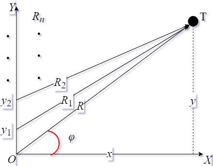
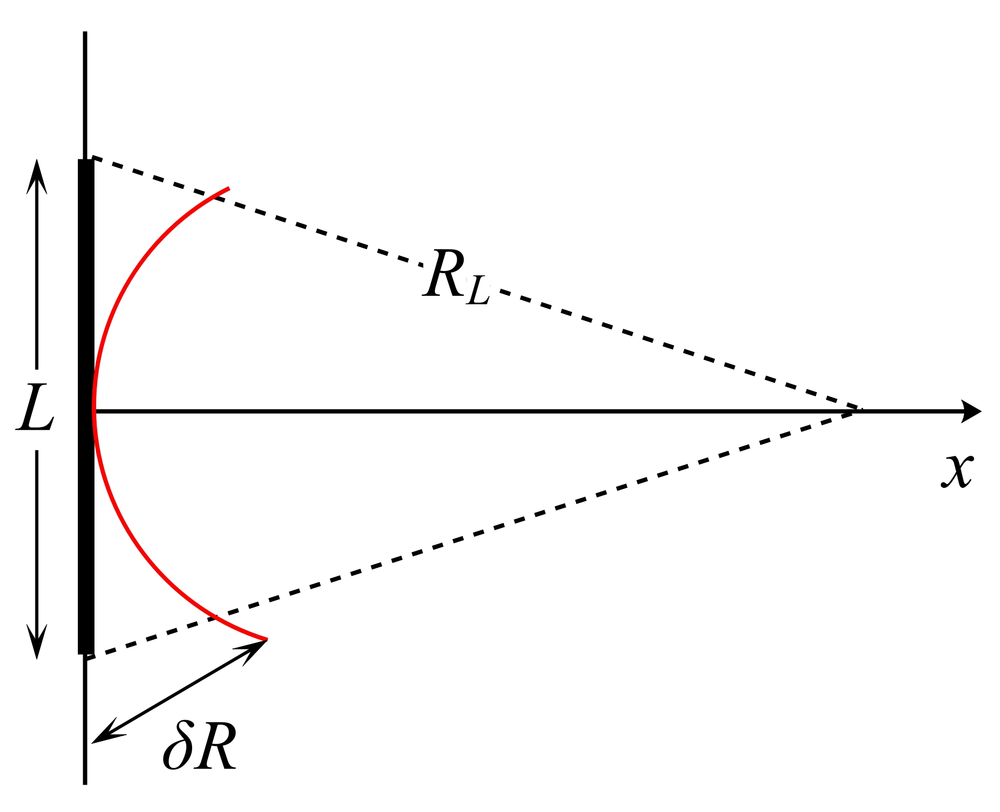
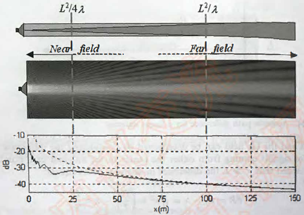
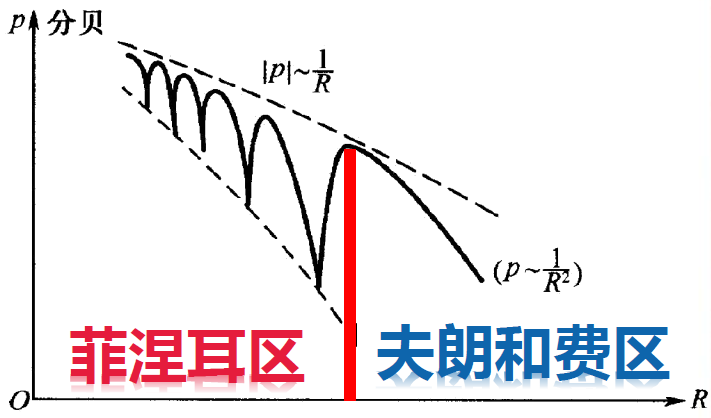

# 7 远场（Far Field）与近场（Near Field）

## 7.1 菲涅尔（Fresnel）和夫琅禾费（FraunHofer）距离近似

当目标点距离一系列源点很远时，这时距离可以近似取值，这就是距离近似的思想。其示意图如图1所示。

<b>图1 距离近似</b>

图1中，$O, y_1, y_2, ... , y_n$ 表示一系列的源点的纵坐标；$T$ 表示目标点；$R, R_1, R_2, ... , R_n$ 分别表示各源点到目标点的距离；$x, y$ 表示目标点 $T$ 的坐标； $\varphi$ 表示原点 $O$ 到目标点 $T$ 的直线与 $X$ 轴之间的夹角。

则我们将原点 $O$ 到目标点 $T$ 的坐标表示为
$$
x = R \cdot \cos \varphi \\
y = R \cdot \sin \varphi
$$
由图1，我们可以使用坐标计算出每一个距离：
$$
R = \sqrt{x^2 + y^2} \\
	R_1 = \sqrt{x^2 + (y - y_1)^2} \\
	R_2 = \sqrt{x^2 + (y - y_2)^2} \\
	\vdots \\
	R_n = \sqrt{x^2 + (y - y_n)^2} \\
$$
通过上面的公式，我们直接推导 $R_n$ 的通式：
$$
R_n = \sqrt{R^2 - 2R \cdot y_n \sin \varphi + y_n^2} \\
	= R \cdot \sqrt{1 - \frac{2y_n}{R}\sin \varphi + y_n^2} \\
$$
通过泰勒展开公式 $\sqrt{1 + x} = 1 + \frac{1}{2}x - \frac{1}{8}x^2 + O( \cdot )$ 可得：
$$
R_n = R(1 - \frac{y_n}{R} \sin \varphi + \frac{y_n^2}{2R^2}(1 - \sin^2 \varphi) + O( \cdot ))
$$
**如果我们只取前两项，则得到夫琅禾费(Fraunhofer)近似：$R_n \approx R \cdot (1 - \frac{y_n}{R} \sin \varphi )$**

**如果我们取前三项，则得到菲涅尔(Fresnel)近似：$R_n \approx R(1 - \frac{y_n}{R} \sin \varphi  + \frac{y_n^2}{2R^2}(1 - \sin^2 \varphi))$**

这两种距离近似在实际中怎么理解呢：
夫琅禾费近似就是在 $R_1, R_2$ 之间作了一个垂线，通过 $y_2$ 点向直线 $OT$ 作垂线，垂足落在直线 $OT$ 上，两条线段的差值近似为 $y_n \sin \varphi$。而菲涅尔是差值的二次近似，相当于一次项的时候减多了，二次项的时候再补回来一点点。

两种距离近似的用途：
> 1. 声场远场中 **声源阵列的** `发射指向性` 和 `接收指向性`；
> 2. 远场时的电磁波衍射。

## 7.2 远场和近场[^1]

> 换能器向空间中辐射声波，根据观察点到换能器的距离可分为两种：
> 1. 近场：在此距离范围内，换能器阵元之间的信号异相，导致声场随距离剧烈振动，表现出较强的相干性，其平均功率要比球面扩散（强度随距离的平方衰减）衰减更慢；
> 2. 远场：在此距离范围内，换能器阵元之间的信号基本同相（不同阵元之间的相位差很小），干涉现象消失，其平均功率与球面扩散衰减相同。

> 其实对于`远场`和`近场`的定义和描述是因人而异的，有的只将声场分为`近场`和`远场`，远近场之间分界为`过渡距离`或`瑞利距离`。`近场`也被称为菲涅尔区，`远场`为夫郎和费区。
> 本文中`近场`和`远场`之间还有一段过渡的距离，所以将远场开始的距离定义为`过渡距离`或`瑞利距离`，我们关心的是远场，只要距离足够远，则一定是`远场`，所以我们讨论的就是这个足够远到底大概是多远呢。不管多远，只要阵列产生的声场的衰减特性符合球面波的衰减特性了，则一定位于`远场`。

假设一个长度为 $L$ 的线性阵列，如图2所示。声波的波场为 $\lambda$。远近场可以由中心轴一点到阵列中心和边缘的长度差来确定。

<b>图2 线性阵列声线路径差图</b>

假设 $x \gg L$，则声线路径差可表示为：
$$
\delta R = R_L - x = \sqrt{x^2 + \left(\frac{L}{2}\right)^2} - x
$$
根据泰勒展开式 $\sqrt{1 + x^2} = 1 + \frac{x}{2} + o(x)$，则 $\sqrt{x^2 + \left(\frac{L}{2}\right)^2} = x \sqrt{1 + \left( \frac{L}{2x} \right)^2} \approx x(1 + \frac{L^2}{8x^2})$，所以
$$
\delta R \approx \frac{L^2}{8x}
$$
当声线距离差大于等于半波长 $\lambda / 2$ 时，此时为近场。
$$
\frac{L^2}{8x} \ge \frac{\lambda}{2} \ \ \ \ \ \ \Rightarrow \ \ \ \ \ \ x \le \frac{L^2}{4 \lambda}
$$
超过近场，虽然声场的干涉现象不再明显，但是其衰减规律与球面波的衰减规律还不完全符合。当声线距离差小于等于 $\lambda / 8$ 或相位差小于等于 $\pi /4$ 时，可以认为所有阵元辐射的声波在此距离外是同相的，即
$$
\frac{L^2}{8 x} \le \frac{\lambda}{8} \ \ \ \ \ \Rightarrow \ \ \ \ \ x \ge \frac{L^2}{\lambda}
$$
当声波传到远场，就可以将声波当作球面波进行处理，其声强随距离的二次方衰减。

对于面状阵列，其瑞利距离为：
$$
D_F \approx \frac{A}{\lambda}
$$
其中 $A$ 为面阵的表面积。

<b>图3 声呐声强随距离变化图[^1]</b>

在近场，波束指向性没有生成，声压剧烈起伏。超过 $x = L^2 / 4 \lambda$，声压不再起伏，表现出明显的单调性，且波束指向性完全生成。远超过距离 $x = L^2 / \lambda$时，声压衰减表现为球面波衰减趋势。

## 7.3 偶极子的远场声压模型

偶极子声压模型如图4所示。

<b>图3 偶极子声压模型</b>

图4中，两个阵元分别为 $E_1, E_2$，且两阵元声压相同但相位反相；两阵元和中心点到目标 $P_{\sum}$ 之间的距离分别为 $R_1, R, R_2$，目标点的坐标为 $(X, Z)$；两阵元距离原点 $O$ 为 $Z_1$。==在下面的讨论中，我们不考虑声能随距离的衰减情况，即水的吸收我们是不考虑的。== 

则偶极子在目标点处的声压可分别表示出来：
$$
P_1 = \frac{P_0R_0}{R1}e^{i(\omega t - kR_1)} \\
P_2 = -\frac{P_0R_0}{R2}e^{i(\omega t - kR_2)} \\
$$
根据距离 $R_1 = \sqrt{(Z - Z_1)^2 + X^2} \approx R \cdot 
\left(
	1 + \frac{Z_1^2}{2R^2} - \frac{ZZ_1}{R^2}
\right), \\ R_2 = \sqrt{(Z + Z_1)^2 + X^2} \approx R \cdot 
\left(
	1 + \frac{Z_1^2}{2R^2} + \frac{ZZ_1}{R^2}
\right)$。那么目标点出的声压可表示为：
$$
P_1 = \frac{P_0R_0}{R}e^{i(\omega t - kR_1)} = P_0R_0 e^{i\omega t}\frac{1}{R1}e^{-ikR_1} \\
P_2 = -\frac{P_0R_0}{R}e^{i(\omega t - kR_2)} = P_0R_0 e^{i\omega t}\frac{1}{R2}e^{-ikR_2} \\
P_s =  P_0R_0 e^{i\omega t} 
\left[ 
	\frac{1}{R1}e^{-ikR_1} - \frac{1}{R2}e^{-ikR_2}
\right] \\
$$
令 $P_{\sum} = \frac{1}{R1}e^{-ikR_1} - \frac{1}{R2}e^{-ikR_2}$。

则 $P_{\sum}$可表示为：
$$
P_{\sum} = \frac{1}{R}
\left[
	\left(
		1 - \frac{Z_1^2}{2R^2} + \frac{ZZ_1}{R^2}
	\right)e^{ikZZ_1/R} - 
	\left(
		1 - \frac{Z_1^2}{2R^2} - \frac{ZZ_1}{R^2}
	\right)e^{-ikZZ_1/R}
\right] \cdot e^{-ikR}e^{-ikZ_1^2/(2R)}
$$
根据复数的运算规则 $e^{ix} + e^{-ix} = 2 \cos x, e^{ix} - e^{-ix} = 2 i \sin x$，则 $P_{\sum}$ 近似等于
$$
P_{\sum} = \frac{2}{R}
\left[
	\frac{ZZ_1}{R^2} \cos \left(k\frac{ZZ_1}{R} \right) + i \sin \left(k\frac{ZZ_1}{R} \right)
\right] \cdot e^{-ikR}
$$
**目标点处的声压与距离的近似关系为：**
$P_{\sum} = \frac{2}{R} \cdot \sin \left({\frac{kZZ_1}{R}}\right) $
画出 $P$ 随距离 $R$ 的变化情况，如图4所示。

当 $R = \frac{kZZ_1}{\left(N + \frac{1}{2}\right) \pi}， N = 0, 1, 2 ...$ 时，声压取极大值；
当 $R = \frac{kZZ_1}{N  \pi}， N = 1, 2 ...$ 时，声压取极小值，声压的最小值为 $P_{min} = \frac{2ZZ_1}{R^3}$。

<b>图5 声压随距离变化示意图</b>

声压由近场菲涅尔干涉区向远场夫琅禾费区的过渡距离 $R_0 = \frac{2kZZ_1}{\pi}$。

当为偶极子的情况下，因为两阵元之间的距离很小，所以声压的模型近似为 $P_{\sum} = \frac{2}{R^2}kZZ_1$ ，也就是几乎没有了过渡距离，直接是单调递减的声压模型。

**由图5可以看出：**

**1. 在距离声源处较近的情况下，声源之间形成干涉现象，声压变化较为剧烈；在离声源较远的情况下，声压随距离单调递减；**

**2. 声压有两条包络线，分别正比于 $\frac{1}{R}$ 与 $\frac{1}{R^3}$；**

**3. 当 $2kZZ_1 \ll R$ 时，声压 $P = i\frac{kly}{R^2}$ 随距离单调递减，且声压模型完全符合球面波传播的声压模型；**

**4. 当为偶极子的情况下，就是远场的情况，所以声压是单调递减的**

**5. 近场波动较大的区域为菲涅尔区，远场单调递减的区域为夫琅禾费区，则其过渡距离为 $R_0 = \frac{2kZZ_1}{\pi}$**。

[^1]: Xavier Lurton. An Introduction to Underwater Acoustics: Principles and Applications[M]. Second Edition. Chichester: Springer-Praxis, 2010: 198-200.
